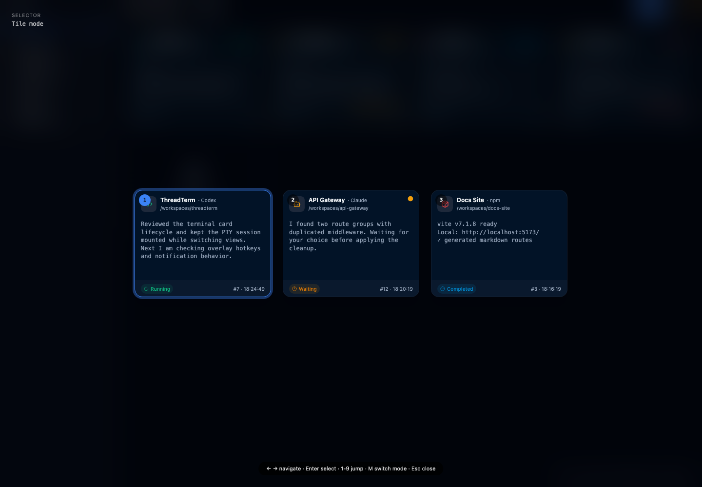
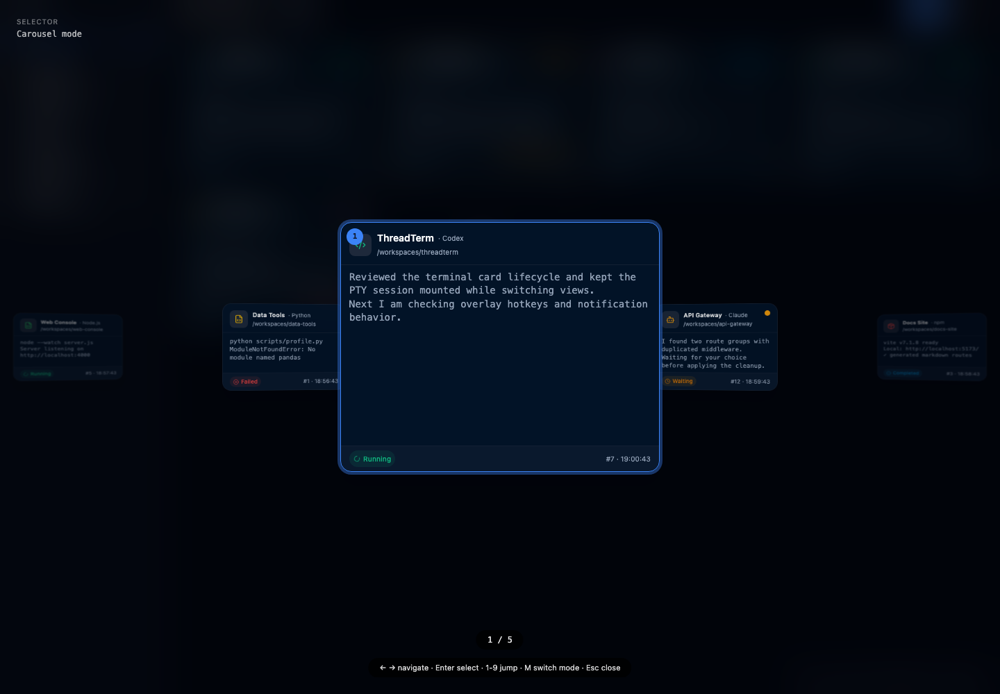
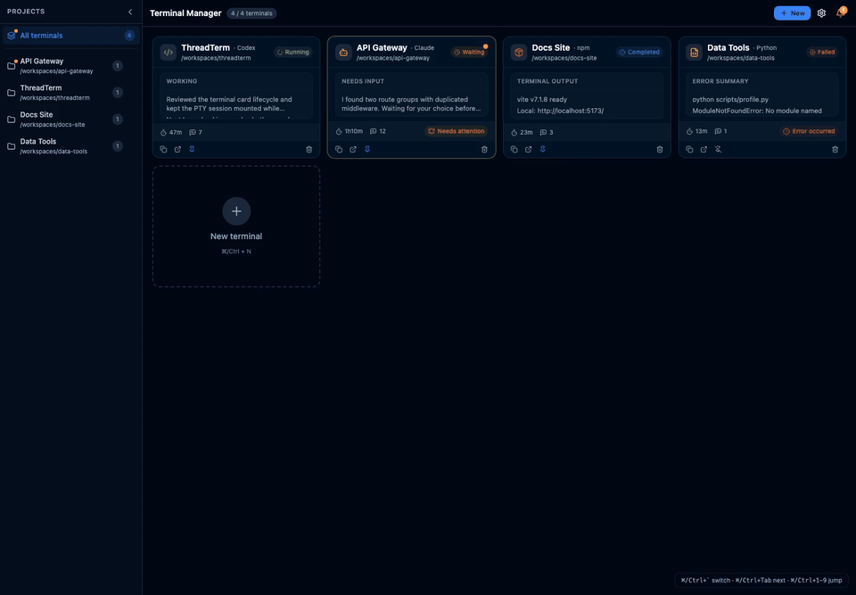
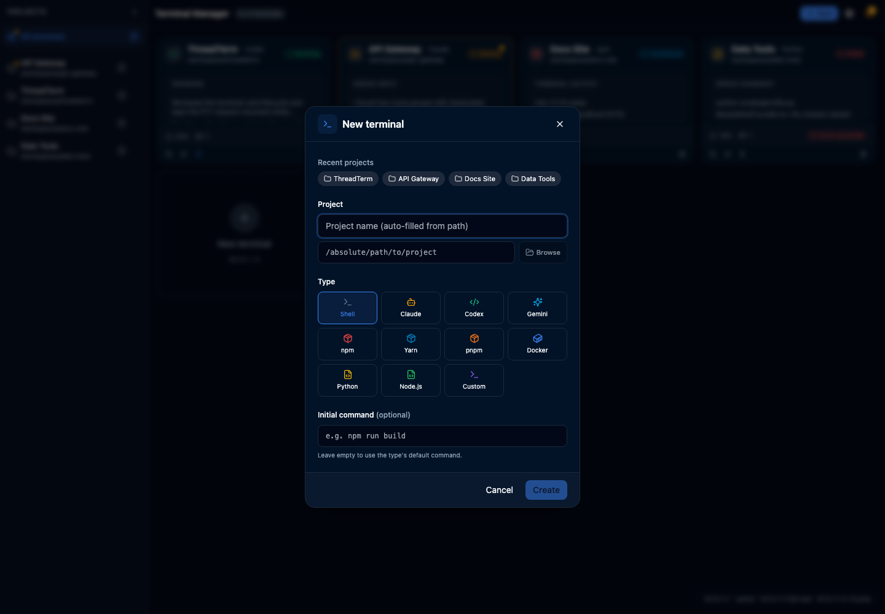
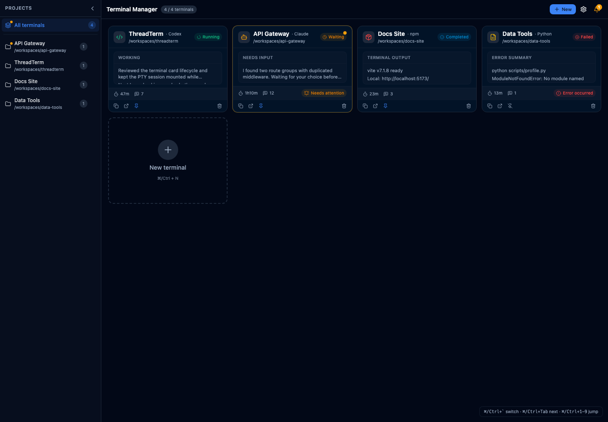
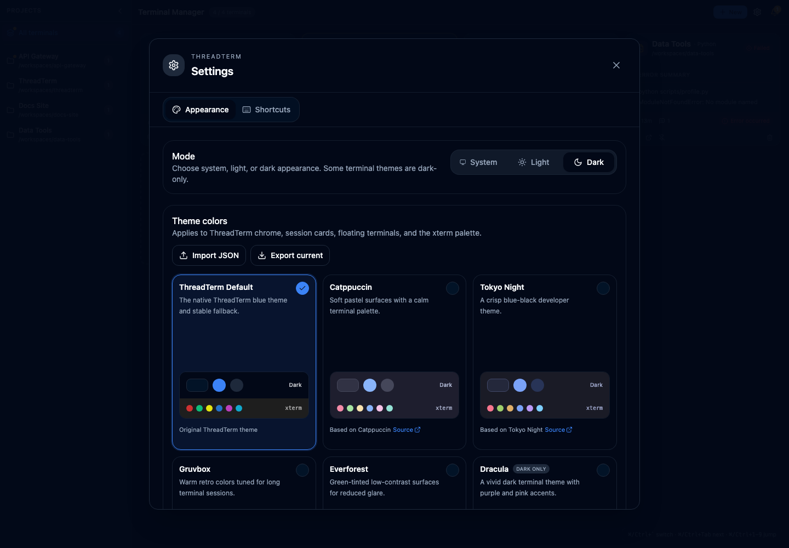

<div align="center">
  
  <h1>ThreadTerm</h1>
  <p><strong>面向 Shell 和 AI CLI 会话的项目化终端卡片管理器。</strong></p>
  <p>
    简体中文
    ·
    <a href="README.md">English</a>
  </p>
  <p>
    
    
    
    
  </p>
</div>

ThreadTerm 是一个桌面端终端管理器，适合同时运行多个项目 Shell、构建任务和 AI CLI 代理的开发者。它把会话组织成可持久展示的卡片，按项目分组，支持把关键会话固定到全局选择器，并能把选中的会话打开为始终置顶的浮动终端。

<p align="center">
  
</p>

<p align="center">
  <a href="#功能亮点">功能亮点</a>
  ·
  <a href="#演示">演示</a>
  ·
  <a href="#快速开始">快速开始</a>
  ·
  <a href="#首次使用">首次使用</a>
  ·
  <a href="#固定会话与选择器模式">选择器模式</a>
  ·
  <a href="#通知">通知</a>
  ·
  <a href="#快捷键">快捷键</a>
  ·
  <a href="#架构">架构</a>
</p>

## 为什么需要 ThreadTerm？

AI 编码工具和长时间运行的项目命令很容易淹没在相似的终端窗口里。ThreadTerm 会把每个工作上下文保留下来，让它们可命名、可预览、可恢复，也能随时从当前应用上方唤出。

| 适合场景 | 解决的问题 |
| --- | --- |
| 多项目并行 | 按项目路径组织终端卡片，切换上下文时不丢会话状态。 |
| AI CLI 会话 | 把 Claude、Codex、Gemini 或自定义命令和普通 Shell 任务放在一起管理。 |
| 快速切换上下文 | 固定重要会话，用全局选择器快速唤出。 |
| 专注工作 | 将单个卡片展开为完整终端，或浮在其他应用之上继续输入。 |

## 功能亮点

| 能力 | 说明 |
| --- | --- |
| 终端卡片 | 支持 Shell、Claude、Codex、Gemini、Python、Node、Docker、npm/yarn/pnpm 和自定义命令。 |
| 项目侧边栏 | 按项目路径分组和筛选卡片，不打断终端工作流。 |
| 聚焦终端视图 | 双击卡片进入完整终端，同时保持卡片和 PTY 状态存活。 |
| 全局选择器 | 按 `Cmd/Ctrl + Shift + Space` 在当前应用上方显示已固定会话。 |
| 浮动终端 | 选中固定卡片后，在始终置顶的浮动终端中继续输入。 |
| 通知 | 跟踪 PTY 状态变化，提供应用内通知中心，并在值得注意的事件发生时发送桌面系统通知。 |
| 主题包 | 使用内置终端风格主题，也可以导入或导出自定义主题 JSON。 |
| 桌面支持 | macOS 和 Windows 是一等支持目标；Linux 取决于桌面环境对全局快捷键的支持。 |

## 固定会话与选择器模式

全局选择器有两种展示方式：平铺模式适合快速浏览多个会话，轮播模式会放大当前选中的会话，同时保留两侧相邻卡片。两种模式都只展示已固定的卡片。如果打开选择器时提示没有固定会话，需要先把卡片加入选择器：

1. 在主界面的卡片网格中创建或找到一个终端卡片。
2. 在卡片底部操作栏点击固定按钮。它和复制路径、打开项目目录按钮在同一排，悬停提示是 `固定到浮层选择器`。
3. 按钮变为已固定状态后，这张卡片就会进入全局选择器、轮播模式和浮动终端候选列表。
4. 按 `Cmd/Ctrl + Shift + Space` 打开全局选择器。主窗口处于焦点时，也可以按 <kbd>Cmd/Ctrl</kbd> + <kbd>&#96;</kbd> 打开内联选择器。
5. 在选择器中按 `M`，即可在平铺模式和轮播模式之间切换。
6. 按 `Enter` 会把当前选中的固定卡片打开为浮动终端；也可以按 `1` 到 `6` 直接选择某个固定卡片。

<table>
  <tr>
    <th width="50%">平铺模式</th>
    <th width="50%">轮播模式</th>
  </tr>
  <tr>
    <td></td>
    <td></td>
  </tr>
  <tr>
    <td>适合快速扫一眼所有固定会话。</td>
    <td>适合在打开前查看更大的当前会话预览。</td>
  </tr>
</table>

补充说明：

- 最多可以同时固定 6 张卡片。
- 再次点击同一个固定按钮，可以把卡片从选择器中移除。
- 平铺模式适合快速扫一眼所有固定会话。
- 轮播模式适合在打开前查看更大的当前会话预览。
- 选择器会记住上次使用的模式，切换后下次会继续以同样模式打开。
- 如需修改全局快捷键，按 `Cmd/Ctrl + ,` 打开设置，然后在快捷键/浮层快捷键区域调整。

## 通知

ThreadTerm 使用两层通知，避免你在继续当前工作的同时错过需要处理的会话：

| 层级 | 作用 |
| --- | --- |
| 应用内通知中心 | 顶部铃铛按钮会打开右侧抽屉，集中展示所有卡片的等待输入、完成、失败和注意事项事件。 |
| 桌面系统通知 | 桌面打包版本会在新事件出现时发送原生系统通知，包含提示音和自动取消行为。 |

点击通知会回到对应会话。如果该卡片已固定，ThreadTerm 可以直接把它打开到浮动终端；未固定的卡片则会在主窗口中聚焦。

## 演示

<p align="center">
  
</p>

<p align="center">
  <a href="./docs/media/threadterm-usage-demo.mp4">下载 MP4 演示视频</a>
</p>

<details open>
<summary><strong>截图</strong></summary>

<table>
  <tr>
    <th width="50%">新建终端</th>
    <th width="50%">通知中心</th>
  </tr>
  <tr>
    <td></td>
    <td></td>
  </tr>
  <tr>
    <th width="50%">外观设置</th>
    <th width="50%">终端网格</th>
  </tr>
  <tr>
    <td></td>
    <td></td>
  </tr>
</table>

</details>

## 快速开始

### 环境要求

| 依赖 | 说明 |
| --- | --- |
| Node.js 22 LTS 和 npm 10+ | 前端工具链和 package scripts。 |
| Rust 工具链 | 从 <https://rustup.rs> 安装。 |
| Tauri CLI | 使用 `cargo install tauri-cli` 安装。 |
| 可选 AI CLI | 如需直接启动预设命令，将 `claude`、`codex`、`gemini` 等工具加入 `PATH`。 |

### 启动桌面应用

```bash
npm install
npm run tauri:dev
```

### 仅启动前端预览

```bash
npm run client
```

### 构建桌面应用

```bash
npm run tauri:build
```

## 首次使用

第一次使用 ThreadTerm？可以按 [首次使用指南](docs/first-run.zh-CN.md)
创建卡片、固定卡片、切换选择器模式、打开浮动终端，并验证通知链路。

## 快捷键

| 快捷键 | 操作 |
| --- | --- |
| `Cmd/Ctrl + N` | 创建新的终端卡片。 |
| `Cmd/Ctrl + 1..9` | 按序号跳转到卡片。 |
| `Cmd/Ctrl + Tab` | 切换到下一个卡片。 |
| `Cmd/Ctrl + Shift + M` | 从聚焦终端返回卡片网格。 |
| `Cmd/Ctrl + B` | 打开或关闭通知中心。 |
| `Cmd/Ctrl + ,` | 打开设置。 |
| `Cmd/Ctrl + Shift + Space` | 显示已固定会话的全局选择器。 |
| <kbd>Cmd/Ctrl</kbd> + <kbd>&#96;</kbd> | 主窗口处于焦点时打开或关闭内联选择器。 |
| 选择器中按 `M` | 在平铺模式和轮播模式之间切换。 |
| 选择器中按 `Enter` | 将当前选中的固定卡片打开为浮动终端。 |

## 项目结构

```text
src/                  主窗口 React UI
src/windows/          选择器和浮动终端窗口入口
src/stores/           终端和浮窗状态的 Zustand store
src-tauri/src/        Tauri 后端：PTY、浮窗、通知、设置、原生会话发现
docs/                 公开指南、打包说明和媒体
```

## 架构

<details>
<summary><strong>运行入口和后端模块</strong></summary>

运行入口：

- `index.html` -> 主终端管理窗口。
- `selector.html` -> 全局选择器浮窗。
- `float.html` -> 浮动终端窗口。

后端模块：

- `src-tauri/src/pty.rs`：本地 PTY 生命周期、输出事件、会话状态和最近输出回放。
- `src-tauri/src/overlay.rs`：全局快捷键、选择器/浮动终端窗口、macOS 全屏 Space 处理和非 macOS 回退行为。
- `src-tauri/src/db.rs`：用于浮窗快捷键和浮动终端位置的小型 SQLite 设置表。
- `src-tauri/src/notification.rs`：正式桌面包中的系统通知分发。
- `src-tauri/src/provider_sessions.rs`：Claude/Codex 原生会话的轻量发现，用于懒恢复。

</details>

## 验证

<details>
<summary><strong>核心检查</strong></summary>

```bash
npm run typecheck
npx vitest run src/components/terminal/TerminalEventBridge.test.tsx src/components/terminal/providerSession.test.ts src/components/terminal/useProjectGroups.test.ts src/stores/overlayStore.test.ts src/stores/terminalStore.test.ts src/theme/themePacks.test.ts
npm run build
cargo check --manifest-path src-tauri/Cargo.toml
cargo test --manifest-path src-tauri/Cargo.toml pty::tests
```

全局浮窗的手动回归步骤见 [docs/global-overlay-manual-test.md](docs/global-overlay-manual-test.md)。

</details>

## Windows 说明

Windows 支持已保留：

- Release 构建保留 `windows_subsystem = "windows"`，避免额外控制台窗口。
- PTY 启动优先使用 `powershell.exe`，不可用时回退到 `cmd.exe`。
- Windows 图标和 Tauri 打包配置保留在 `src-tauri/icons/` 和 `src-tauri/tauri.conf.json`。

## 文档

- [贡献指南](CONTRIBUTING.md)
- [首次使用指南](docs/first-run.zh-CN.md)
- [路线图](ROADMAP.md)
- [构建和发布](docs/build-release.md)
- [Windows EXE 构建](docs/windows-exe-build.md)
- [全局浮窗手动测试](docs/global-overlay-manual-test.md)

## 主题来源

<details>
<summary><strong>受第三方启发的主题包</strong></summary>

ThreadTerm 包含原创主题和受第三方主题启发的主题包。第三方主题会在应用的外观设置中标明来源，这里也同步列出：

- **ThreadTerm Default**：ThreadTerm 原创主题。
- **Catppuccin**：基于 [Catppuccin](https://catppuccin.com/palette/)（[许可证](https://github.com/catppuccin/catppuccin/blob/main/LICENSE)）。
- **Tokyo Night**：基于 [tokyonight.nvim](https://github.com/folke/tokyonight.nvim)（[许可证](https://github.com/folke/tokyonight.nvim/blob/main/LICENSE)）。
- **Gruvbox**：基于 [gruvbox](https://github.com/morhetz/gruvbox)（[许可证](https://github.com/morhetz/gruvbox#license)）。
- **Everforest**：基于 [everforest](https://github.com/sainnhe/everforest)（[许可证](https://github.com/sainnhe/everforest/blob/master/LICENSE)）。
- **Dracula**：基于 [Dracula Theme](https://draculatheme.com/spec)（[许可证](https://github.com/dracula/dracula-theme/blob/main/LICENSE)）。

上述上游项目并不为 ThreadTerm 背书；这里保留署名是为了尊重原主题作者和对应许可证。

</details>

## 许可证

见 [LICENSE](LICENSE)。
