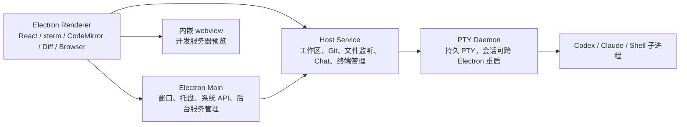
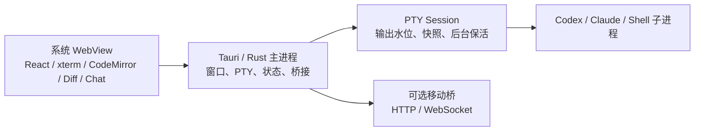

# Superset 与 ThreadTerm：Windows、内存与性能对比研究

> 研究日期：2026-08-02
> Superset 基准：`d1ea13ede31c8e0a589af92d420e26a73e3b263e`（2026-08-01）
> Superset 正式版：`desktop-v1.18.1`（2026-07-28）
> ThreadTerm 基准：`9b61115`
> 结论性质：源码审查、正式发布核验、项目方专项测试复核；未构建 Superset 的社区 Windows 草案

## 一、结论先行

1. **Superset 目前没有正式交付 Windows 桌面版。** 最新正式版有 macOS 和 Linux 安装资产，但没有 Windows EXE；正式构建流水线也没有 Windows 任务。主仓库虽然已经存在 NSIS 配置和部分 Windows 分支，但不能等同于可安装、可更新、经过正式验证的 Windows 产品。

2. **Superset 的完整 Windows 方案仍是未合并的社区草案。** 主要草案 [PR #5210](https://github.com/superset-sh/superset/pull/5210) 仍为 Draft，涉及 259 个文件、约 10,765 行新增和 1,959 行删除。它解决了 ConPTY、命名管道、Windows Shell、进程树清理、原生依赖、NSIS、更新器等问题。这说明 Electron 能提供跨平台界面底座，但不会自动消除操作系统适配工作。

3. **同等初始页面和功能下，Electron 通常比 Tauri 有更高的基础内存成本。** Electron 随应用携带 Chromium 和 Node.js；Tauri 在 Windows 复用系统 WebView2，在 macOS 复用 WKWebView。这个结论是架构方向判断，不是 Superset Windows 实测，因为 Superset 尚无正式 Windows Release。

4. **Superset 自己的测量也表明，多终端产品达到 1 GB 级渲染内存并不罕见。** 在其专项测试中，优化后的 16 终端场景渲染进程仍约 838 MB；24 个持续输出终端场景约 1.165 GB，切换后约 1.277 GB。优化前部分场景达到 1.5–1.8 GB。

5. **Superset 最有价值的优化不是“换了技术栈”，而是把后台会话与终端画面拆开。** 终端进程继续运行，但不可见的 xterm、WebGL 和大段历史可以释放，切回时再重建。这与 ThreadTerm 在 `9b61115` 已落地的“所有可见终端 + 1 个预热终端”方向一致。

6. **Superset 为节省内存接受了明确的体验取舍。** 被回收的终端只恢复持久化的 1,000 行窗口，并增加约 17 ms 的中位切换耗时；运行中的全屏 TUI 又会被豁免，可能突破数量上限。ThreadTerm 不能照搬这两个边界，因为当前契约要求 3,000 行恢复测试、TUI 正确性和 Release 下 P95 不超过 300 ms。

7. **ThreadTerm 观察到的 900 MB～1.1 GB 不能全部归因于 WebView2。** 已有冷启动 Release 基线远低于这个数字；热态增长主要来自终端显示面、WebGL、编辑器、Diff、Chat 和缓存。任务管理器若把 Codex、Claude、Shell 等子进程一起算入，还会进一步放大“应用总内存”。

8. **不建议为了内存迁移到 Electron，也不建议仅把 Rust 改成 Go。** Go/Wails 在 Windows 同样使用 WebView2；后端语言变化不会自动释放前端的 xterm、CodeMirror、Diff 或 Chat DOM。先完成现有生命周期治理和同机 Release 验收，收益与风险比更合理。

## 二、证据边界与指标口径

### 2.1 证据等级

| 等级 | 含义 | 本文用法 |
|---|---|---|
| A：直接可核验 | 正式 Release、构建流水线、当前源码、带完整条件的测试记录 | 可直接作为项目现状 |
| B：项目方或社区自述 | PR 验证说明、社区 Windows 移植记录 | 可以引用，但不能写成正式产品能力 |
| C：架构推断 | 根据进程模型、依赖和资源生命周期作出的判断 | 明确使用“预计”“通常”或“可能” |

### 2.2 内存指标不能混用

| 指标 | 实际含义 | 常见误区 |
|---|---|---|
| JavaScript heap | JavaScript 对象占用，只是渲染进程的一部分 | 不能当作应用总内存 |
| RSS | 某个进程当前驻留在物理内存中的页面，包含私有和部分共享页面 | 多进程简单相加可能重复计算共享页 |
| 私有工作集 | 当前驻留且主要归该进程私有的页面 | 更适合观察 Windows 应用当前实际压力 |
| 私有提交 | 已承诺给进程的私有内存，可部分被换出 | 通常高于当前物理驻留量 |
| 进程树总量 | 主程序、界面、GPU、后台服务、PTY、Agent 等总和 | 必须说明是否包含 Codex/Claude 等外部进程 |

因此，Superset 的“启动 JavaScript heap 150 MB”不能直接与 ThreadTerm 的“WebView2 私有工作集 108.3 MB”相减；二者不是同一个指标。

## 三、Superset 是什么，以及和 ThreadTerm 像在哪里

Superset 把自己定位为面向 Claude Code、Codex 等命令行 Agent 的桌面工作区。它具备多工作区/Worktree、多终端、Agent 状态、Diff、编辑器、内嵌浏览器、远程 Host 和移动访问等能力，产品形态与 ThreadTerm 确实接近。[项目 README](https://github.com/superset-sh/superset)

主要差异是资源边界：

- Superset 以 **workspace/worktree** 为核心，终端、Changes、Diff、浏览器和 Agent 状态围绕工作区组织。
- ThreadTerm 当前更强调 **项目、分支树、终端卡和工作台**，并正在补齐项目级文件/Diff 与终端之间的使用关系。
- Superset 把大量业务放入 JavaScript 后台服务；ThreadTerm 的 PTY、桥接和多数系统能力位于 Rust/Tauri 后端。

## 四、Superset 正式 Windows 状态

### 4.1 截至 2026-08-02 的平台结论

| 平台 | 正式资产 | 正式流水线 | 结论 |
|---|---:|---:|---|
| macOS arm64/x64 | 有 DMG/ZIP | 有 | 正式主平台 |
| Linux x64 | 有 AppImage | 有 | 已经实际发布，但 README 的“未提供 Linux build”说明已滞后 |
| Windows x64 | 无 EXE/MSI | 无 Windows job | 未正式交付 |
| Windows arm64 | 无 | 无 | 不在当前草案 GA 范围 |

证据：

- [`desktop-v1.18.1` Release](https://github.com/superset-sh/superset/releases/tag/desktop-v1.18.1) 中唯一的桌面安装资产是 macOS ZIP/DMG 和 Linux AppImage，没有 Windows EXE。
- [正式构建流水线](https://github.com/superset-sh/superset/blob/d1ea13ede31c8e0a589af92d420e26a73e3b263e/.github/workflows/build-desktop.yml) 只有 `macos-latest` 与 `ubuntu-latest`。
- [README](https://github.com/superset-sh/superset#requirements) 仍写着 Windows/Linux 未测试和安装包不可用；Linux 已有 AppImage，因此平台现状应以 Release 与流水线为准。

### 4.2 为什么源码里有 Windows 配置，仍不能说“支持 Windows”

当前主线的 [`electron-builder.ts`](https://github.com/superset-sh/superset/blob/d1ea13ede31c8e0a589af92d420e26a73e3b263e/apps/desktop/electron-builder.ts) 已配置：

- Windows x64；
- NSIS 安装器；
- 非一键安装；
- 允许用户选择安装目录。

但交付一个 Windows 产品还需要同时满足：

- Windows CI 能稳定构建；
- Electron 原生模块能针对 Windows ABI 重建；
- node-pty 使用 ConPTY；
- Unix socket 替换为 Windows 命名管道；
- cmd、PowerShell、pwsh 与 Git Bash 命令规则正确；
- 进程树能可靠结束，不能留下 Agent 或 PTY 孤儿进程；
- 托盘、开机启动、深链、更新器、签名和安装卸载经过验证；
- 正式 Release 实际发布 Windows 资产。

Superset 主线当前尚未把这条链路闭环。其自动更新代码也只把 macOS 和 Linux 列为支持平台，进一步说明 Windows 仍不是正式发布目标。

### 4.3 未合并 Windows 草案做了什么

[PR #5210](https://github.com/superset-sh/superset/pull/5210) 是目前最完整的 Windows 移植草案。以下属于 **B 级证据**：来自草案作者的实现与验证记录，不是 Superset 官方正式承诺。

| Windows 难点 | 草案方案 | 对用户的意义 |
|---|---|---|
| Shell 差异 | 识别 cmd、PowerShell、pwsh、Git Bash，并按 Shell 生成命令 | 配置、连续命令和退出码不再因 `&&` 等语法差异出错 |
| 本地进程通信 | Unix socket 改为 `\\\\.\\pipe\\...` 命名管道 | Host、终端守护进程能在 Windows 原生通信 |
| 终端运行 | node-pty 接 ConPTY，补关闭、输入、resize 和恢复测试 | Windows 终端不依赖伪 Unix 环境 |
| 进程清理 | 使用 `taskkill.exe /PID ... /T /F` 清理进程树 | 关闭会话时减少残留 Agent/子进程 |
| 构建脚本 | 将大量 shell 脚本迁到 Bun/TypeScript | 不再要求 Bash 才能安装或打包 |
| 原生依赖 | 检查 VS Build Tools、MSVC v143、Spectre 库和 Windows SDK | better-sqlite、node-pty 等原生模块可正确构建 |
| 安装 | Windows x64、每用户 NSIS、可选重置本地数据 | 形成可安装产品，而不只是源码能启动 |
| 系统集成 | 托盘、最小化到托盘、开机启动、深链、通知钩子 | 符合 Windows 桌面使用习惯 |
| 更新 | 桌面端 electron-updater 负责更新 | 避免 CLI 和桌面端同时更新造成冲突 |
| 凭据与脚本 | Windows askpass、`.cmd` wrapper、PowerShell 脚本 | Git 和 Agent 登录链路不再依赖 `/bin/sh` |

草案作者报告其本地通过了安装、登录、Codex、ConPTY、PTY daemon、工作区和大量集成测试，但 PR 仍是 Draft，尚未进入正式流水线。另一个较小的 [PR #5961](https://github.com/superset-sh/superset/pull/5961) 只涉及少量平台补丁，不能替代完整移植。

**判断：** Superset 的 Windows 工作不是“加一个构建目标”，而是一项横跨安装、Shell、PTY、IPC、进程生命周期、原生模块和更新的完整平台工程。ThreadTerm 已经原生运行在 Windows，因此不应为了换 Electron，重新承担这套移植风险。

## 五、Superset 桌面端架构

### 5.1 进程与职责

来源：[Host Service Architecture](https://github.com/superset-sh/superset/blob/d1ea13ede31c8e0a589af92d420e26a73e3b263e/apps/desktop/docs/HOST_SERVICE_ARCHITECTURE.md)、[Host Service Lifecycle](https://github.com/superset-sh/superset/blob/d1ea13ede31c8e0a589af92d420e26a73e3b263e/apps/desktop/docs/HOST_SERVICE_LIFECYCLE.md)。

| 层 | 主要职责 | 主要内存来源 |
|---|---|---|
| Electron Main | 应用生命周期、窗口、托盘、系统能力、启动 Host Service | Chromium/Node 基础运行时、IPC、系统对象 |
| Renderer | React UI、xterm、WebGL、CodeMirror、Diff、Chat | JS heap、DOM、GPU 上下文、终端历史 |
| Web embed | 内嵌开发服务器页面 | 每个嵌入页面对应额外渲染资源 |
| Host Service | 工作区、Git、文件监听、AI Chat、终端服务 | JS 运行时、数据库、索引、缓存、worker |
| PTY Daemon | 持久化 PTY 与会话恢复 | 每会话缓冲、协议连接、进程元数据 |
| Agent 子进程 | Codex、Claude、Shell 和用户命令 | 完全取决于外部 Agent，自身可能很大 |

Superset 主窗口开启了 `webviewTag`。Electron 官方进程模型说明，每个 `BrowserWindow` 和每个网页嵌入都可能拥有独立渲染进程。因此 Superset 后来把隐藏网页视图数量限制为 3，并在切回时重建。[Electron Process Model](https://www.electronjs.org/docs/latest/tutorial/process-model)

### 5.2 为什么它的基础盘子较重

Superset 当前 [桌面依赖](https://github.com/superset-sh/superset/blob/d1ea13ede31c8e0a589af92d420e26a73e3b263e/apps/desktop/package.json) 包括 Electron 40、React 19、xterm/WebGL、CodeMirror、Electric/TanStack DB、SQLite、Diff/Tree worker、node-pty 等。其基础占用并不只是“一张网页”：

- Electron 自带 Chromium 和 Node；
- Renderer 启动完整工作区 UI；
- Host Service 与 PTY Daemon 是额外进程；
- 当前活跃组织会预加载多张同步数据表；
- Diff 使用 8 个 renderer worker；
- 终端和内嵌浏览器可创建更多 GPU/renderer 资源。

这套架构换来了统一的 Web 能力、成熟的 Chromium 行为、Node 原生模块生态和远程 Host 扩展性，但固定成本与资源治理压力也更高。

## 六、Superset 的内存与性能实测

主要来源为 Superset 仓库中的 [`MEMORY_AND_WORKERS_REVIEW.md`](https://github.com/superset-sh/superset/blob/d1ea13ede31c8e0a589af92d420e26a73e3b263e/apps/desktop/docs/MEMORY_AND_WORKERS_REVIEW.md) 和 [官方性能公告](https://superset.sh/changelog/2026-07-19-performance-memory-and-load)。

必须注意：

- 仓库报告说明测试来自 live dev app 和 CDP 专项场景；
- 没有正式 Windows Release 数据；
- 部分测试使用了低于默认值的终端保留上限；
- Renderer RSS 不等于整棵 Superset 进程树；
- CPU 结果中有一组没有稳定复现，不能推广为普遍收益。

### 6.1 启动和逐步增加终端

以下为终端回收优化前的专项样本：

| 场景 | Renderer JS heap | Renderer RSS | 解读 |
|---|---:|---:|---|
| 启动，数据尚未同步 | 150 MB | 未给出 | 只是 JS 对象，不含完整 Electron 进程树 |
| 当前组织数据同步完成 | 204 MB | 未给出 | 启动数据预加载增加约 54 MB heap |
| 再打开 1 个终端 | 219 MB | 未给出 | 单终端开始增加 xterm 与渲染状态 |
| 再写入约 6,000 行 | 254 MB | 未给出 | 历史缓冲继续放大 heap |
| 5 个终端 | 314 MB | 未给出 | 随 live xterm 数量增长 |
| 18 个终端，17 个隐藏 | 558–570 MB | 1.54–1.59 GB | 隐藏终端此前仍保留全部 xterm/WebGL |

这组数据证明两点：

1. Superset 冷启动业务数据本身就不轻；150 MB 只是 JS heap，不能当作全部内存。
2. 真正把占用推到 1 GB 以上的是隐藏终端显示面、历史和 GPU 上下文长期驻留，而不仅是 Electron 的固定底座。

### 6.2 18 个终端的受控前后对比

测试条件：每个终端写入约 5,000 行；优化后的“后台终端保留上限”设为 5，而正式默认值是 12。

| 指标 | 优化前 | 优化后 | 变化 |
|---|---:|---:|---:|
| live xterm | 17 | 6 | 释放 11 个 |
| live WebGL 上下文 | 17 | 6 | 释放 11 个 |
| heap 中终端行数 | 85,157 | 30,288 | 明显下降 |
| JS heap | 658 MB | 381 MB | -42% |
| Renderer RSS | 1,655 MB | 1,139 MB | -31% |
| 切换终端 p50 | 59 ms | 76 ms | 慢约 17 ms |

业务解释：Agent 和 PTY 继续运行，只销毁用户当前看不到的终端画面。切回时需要重新创建 xterm，并恢复保存的 1,000 行，所以节省内存不是完全无代价。

### 6.3 24 个持续输出终端

测试条件：24 个真实 PTY 持续输出，每个约 40 KB/s；后台终端保留上限同样为 5。

| 指标 | 优化前 | 优化后 | 变化 |
|---|---:|---:|---:|
| live xterm/WebGL | 23 | 6 | 大幅减少 |
| JS heap 稳态 | 836→846 MB，继续增长 | 373→376 MB，基本稳定 | 从增长转为有界 |
| Renderer RSS | 1,741 MB；切换后 1,839 MB | 1,165 MB；切换后 1,277 MB | 降低约 0.5–0.6 GB |
| Renderer CPU | 单核约 30% | 单核约 21% | 仅该工作负载成立 |
| 切换 p50/p95 | 52/95 ms | 68/114 ms | 切换略慢 |

报告另一次合成输出复测没有复现 CPU 降幅，所以可靠结论是“内存显著下降、增长被控制”，而不是“CPU 一定下降 30%”。

### 6.4 官方公开的 16 终端结果

Superset 官方公告给出的场景是 16 个终端、每个约 5,000 行：

| 指标 | 优化前 | 优化后 |
|---|---:|---:|
| live GPU context | 16 | 4 |
| 保留历史行 | 80,016 | 20,004 |
| JS heap | 581 MB | 286 MB（-51%） |
| Renderer RSS | 1,127 MB | 838 MB（-26%） |

公告同时写明正式默认后台终端上限为 12。但该测试最终只有 4 个 live context，因此它显然不是“默认 12”下的结果。合理推断是测试使用了更低的自定义上限；正式默认配置的收益会更小，不能直接宣传为固定 -26%。

### 6.5 大型仓库 Changes/Diff 场景

测试条件：8 个工作区、每个 20,000 个文件、600 个 dirty 文件，并在 60 秒内产生 192,000 次文件写入。

问题根因不是 Git 算法本身，而是 Changes 列表把大量文件行一次性挂到界面。改成有边界的虚拟列表后：

| 指标 | 优化前 | 最终共享 Pierre 实现 |
|---|---:|---:|
| 峰值 Renderer RSS | 1,727.9 MiB | 917.9 MiB |
| CDP 超时 | 3 | 0 |
| 最大界面往返延迟 | 1,563.2 ms | 119.2 ms |
| 最大事件循环延迟 | 6,644 ms | 210.4 ms |
| 600 条逻辑记录实际挂载 | 未限制 | 约 43 行 |

绝对 RSS 会受每次新启动状态影响，因此这里最可靠的证据是：挂载行数有稳定上限、超时消失、界面延迟显著收敛。

### 6.6 Git 与后台扫描

Superset 把 Git 状态和提交文件读取移到 Host Service worker pool，并限制文件监听事件批次。官方同场景结果：

| 指标 | 优化前 | 优化后 |
|---|---:|---:|
| 文件监听阻塞 p99 | 31.7 ms | 10.7 ms |
| 文件监听最坏阻塞 | 82.3 ms | 28.0 ms |
| 完整 status p99 | 24.5 ms | 9.5 ms |
| 完整 status 最坏值 | 49.0 ms | 17.6 ms |

端口检测也从“每个终端各扫一次”改为“全局每轮一次”：

| 场景 | 优化前 | 优化后 |
|---|---:|---:|
| 15 终端、每轮进程扫描 | 15 次 | 1 次 |
| 6 轮总扫描 | 90 次 | 6 次 |
| 空闲终端扫描周期 | 2.5 秒 | 30 秒 |

这一做法对 ThreadTerm 很有价值：同一种系统信息应共享采样结果，空闲时降低频率，终端重新输出时再恢复灵敏度。

### 6.7 当前仍存在的内存/性能压力

Superset 自己的审查还记录了以下未完全闭环项：

- 当前组织会预加载约 30 个同步集合；测试组织已有 3,501 个 PR、1,719 个任务、613 个运行记录和 263 个 Chat 会话，约占 50 MB heap。旧组织可回收，但当前组织仍缺完整窗口化。
- Diff/语法高亮使用 8 个 renderer worker，worker 能减少主线程卡顿，但自身也有固定内存。
- Chat 消息列表尚未虚拟化；流式更新会不断重建较长列表。
- Chat 代码块会在主线程分别为浅色和深色主题做两次高亮。
- 运行中的全屏 TUI 不参与终端回收，活跃 TUI 多时仍可突破终端上限。
- 开发环境曾观察到 2 个 Host Service，RSS 约 321/465 MB，并各带约 60 MB 的 PTY Daemon；这是开发拓扑样本，不能当成正式版固定值，但说明整棵进程树会显著高于 Renderer 数字。
- 资源快照遥测曾加入，随后在 `desktop-v1.18.1` 的 [PR #5964](https://github.com/superset-sh/superset/pull/5964) 中移除，因此不能宣称 Superset 当前拥有持续的用户端内存遥测。

## 七、ThreadTerm 当前架构和内存基线

### 7.1 架构

ThreadTerm 的 [`package.json`](../package.json) 使用 React 18、xterm 6、CodeMirror 6 和 Zustand；[`Cargo.toml`](../src-tauri/Cargo.toml) 使用 Tauri 2、Rust、portable-pty、wezterm-term、rusqlite 与 Tokio。

与 Superset 相比：

- ThreadTerm 不随安装包携带完整 Chromium 和 Node.js；
- Windows 使用系统 WebView2，macOS 使用系统 WKWebView；
- PTY、终端快照、移动桥等主要在 Rust 进程内，不需要一套通用 JavaScript Host Service；
- 但界面仍然是 Web 技术，xterm、WebGL、CodeMirror、Diff 与 Chat 的内存规律不会因为后端是 Rust 就自动消失。

Tauri 官方说明 Windows 使用系统 WebView2、macOS 使用 WKWebView：[WebView Versions](https://v2.tauri.app/reference/webview-versions/)。

### 7.2 已有测量

来源：[WebView 内存任务 PRD](../.trellis/tasks/08-01-webview-memory-lifecycle/prd.md)。

| 场景 | 已记录数据 | 能说明什么 |
|---|---|---|
| Windows Release 冷启动 | WebView2 进程组约 108.3 MB 私有工作集；ThreadTerm 应用组约 113.9 MB | 900 MB 不是冷启动固定成本 |
| 开发构建样本 | 6 个 WebView2 进程约 273.1 MiB 工作集、492.1 MiB 私有提交；Rust 主进程约 65.8 MiB | 用于拆分构成，不能作为 Release 验收 |
| 用户热态观察 | 常见约 800–900 MB；打开多个终端后约 1.1 GB | 是真实体验信号，但未统一构建、场景和进程口径 |
| 本地安装资产 | NSIS 安装包 5,971,464 字节；主 EXE 17,843,712 字节 | ThreadTerm 没有携带完整 Chromium；仅为本地 2026-07-31 构建，不是正式发布对比 |

这里没有把 Release 的两个进程组直接相加为“总内存”，因为采样脚本对进程归属和共享页的定义需要在最终 Release 验收中保持一致。

### 7.3 `9b61115` 已完成的治理

来源：[Batch Status](artifacts/webview-memory-lifecycle/batch-status.md)。

| 批次 | 已完成结果 | 业务含义 |
|---|---|---|
| 采样与诊断 | Windows 采样工具、角色诊断钩子、统一场景记录 | 能知道内存花在什么界面和进程，而不只看任务管理器总数 |
| 无损恢复契约 | 3,000 行、TUI、Unicode、序列交错、主窗口/浮窗、失败与重挂载测试 | 回收画面不能以丢历史或破坏 TUI 为代价 |
| 终端显示面池 | 所有可见显示面 + 最近 1 个预热显示面；带回滚开关 | 多个终端继续运行，但不可见终端不再各占一套 xterm/WebGL |
| 辅助窗口 | selector 低内存与闲置销毁；float 保留原生命周期语义 | 不常用浮窗不无限占用独立 WebView |
| 编辑器回收 | 干净、非当前编辑器按 warm LRU 回收 | 已修改文件、当前文件和 Diff 仍受保护 |

### 7.4 尚未完成，不能写成成果

- 37 张卡、6 个终端、长 Chat、多编辑器、selector/float 的完整 Windows Release 热场景尚未跑。
- Windows/macOS 同机前后对比尚未完成，不能宣称已经实现“至少降低 30%”。
- 终端恢复 P95 不超过 300 ms、单次不超过 1 秒尚未在 Release 真机量化。
- Chat 长列表虚拟化暂停，等待 Claude 数据和生命周期先稳定。
- 移动端与完整生命周期 E2E 尚未作为本批最终验收全部执行。

因此，当前合理说法是“代码侧主要生命周期策略已经落地，最终内存收益待 Release 验收”，而不是“ThreadTerm 已经比 Superset 省多少百分比”。

## 八、逐项对比

| 维度 | Superset | ThreadTerm | 判断 |
|---|---|---|---|
| 桌面容器 | Electron 40，自带 Chromium + Node | Tauri 2，复用系统 WebView | 同等简单页面下，ThreadTerm 基础盘子通常更小 |
| 正式 Windows | 无正式安装包和 CI | Windows 主路径已长期开发 | ThreadTerm 当前成熟度明显更高 |
| macOS | 正式主平台 | 有 macOS/NSPanel 适配 | 都能覆盖，但 ThreadTerm 仍需本轮内存真机验收 |
| Linux | 已有 AppImage | 当前不是核心目标 | Superset 覆盖更广 |
| 安装体积 | 正式资产约 581–696 MB | 本地 NSIS 约 5.97 MB | 差距不全由 Electron造成，Superset 还打包 CLI/原生运行时等 |
| 主界面 | Electron renderer | WebView2/WKWebView renderer | 两者都要治理 React、DOM、xterm 和 GPU |
| 后台业务 | Electron Main + Host Service + PTY Daemon | Rust/Tauri 主进程 + PTY session | Superset 进程更多、隔离更强；ThreadTerm 路径更短 |
| 会话持久 | 独立 PTY Daemon 可跨 Electron 重启 | Rust PTY runtime、快照和消费水位 | 两者都把会话生命与当前画面分离 |
| 隐藏终端 | 默认保留 12 个，可配置 2–64；其余重建 | 可见终端 + 1 个预热，其他显示面释放 | ThreadTerm 当前策略更激进、更省内存 |
| 历史恢复 | xterm scrollback 5,000；回收后恢复 1,000 行 | 契约测试覆盖 3,000 行，后台输出仍保留 | ThreadTerm 更强调恢复完整性 |
| TUI | 活跃 alternate-screen TUI 不回收 | 以快照/TUI 契约保护正确性 | Superset 方案可能突破上限，ThreadTerm 需坚持有界且正确 |
| 内嵌浏览器 | 支持 webview，隐藏上限 3 | 目前更多是预览/外部浏览能力 | Superset 功能更重，也多一类 renderer 成本 |
| Changes/Diff | workspace 中统一组织，超大列表已虚拟化 | 编辑器/Diff 已有保护和回收；项目级使用模型仍在优化 | Superset 的工作区边界值得参考 |
| Chat | 数据与工具链丰富，但列表未完全虚拟化 | Claude/Codex Chat 正在稳定，虚拟化未开始 | 两边都还有明显空间 |
| Git 高频任务 | Host Service worker pool，文件事件有界 | Rust 后端已有并发基础，仍需按热点逐项验收 | ThreadTerm 不必复制 8 worker，只需隔离真正阻塞项 |
| 移动/远程 | Host/device/云端架构完整 | 局域网移动桥更轻量 | 产品目标不同，不能只比内存 |

## 九、Electron、Tauri 与 Go/Wails：初始内存判断

### 9.1 为什么 Electron 通常更高

Electron 官方说明其二进制内嵌 Chromium 和 Node.js，并采用 Chromium 多进程模型。[Electron Introduction](https://www.electronjs.org/docs/latest/)、[Process Model](https://www.electronjs.org/docs/latest/tutorial/process-model)

初始打开时，即便没有终端，通常也会存在：

- Electron Main；
- Renderer；
- GPU；
- 网络/utility 等 Chromium 辅助进程；
- 应用自己的 preload、后台服务与初始数据。

Tauri 使用系统 WebView，不需要把完整 Chromium 和 Node 一起放进应用分发包，因此在同等页面下通常有更低的安装体积和基础内存。但是 WebView2 本身也是 Chromium 多进程架构，并非“零成本”。

### 9.2 为什么不能给出精确倍数

本次没有可用的 Superset Windows Release，所以不存在严格的同机冷启动 A/B。现有两组数据口径不同：

- Superset：启动 Renderer JS heap 150 MB，数据同步后 204 MB；
- ThreadTerm：Windows Release 的 WebView2 私有工作集约 108.3 MB，另有应用组约 113.9 MB。

前者只统计 JavaScript 对象，后者统计进程驻留私有页。直接得出“Electron 是 Tauri 的 1.5 倍或 2 倍”是不严谨的。

可以确定的只有方向：

- **冷启动：** 同等业务下，Electron 通常更重。
- **热态：** 谁保留更多终端画面、历史、编辑器、Diff、Chat 和 WebView，谁可能更重。
- **整机：** Codex/Claude 本身可能比容器差异还大，必须拆开统计。

### 9.3 换成 Go 是否有帮助

Wails 官方说明 Go 后端配合 WebView 前端；Windows 仍依赖 WebView2。[Wails 工作方式](https://wails.io/docs/howdoesitwork/)、[Windows WebView2](https://wails.io/docs/next/guides/windows/)

因此：

- Rust 换 Go，可能改变后端开发体验、编译生态和少量原生内存；
- xterm、WebGL、CodeMirror、React、Diff 和 Chat DOM 仍在 WebView 中；
- 如果不改变显示面和数据生命周期，900 MB 热态问题不会因为 Go 自动消失；
- 纯原生 UI 可能进一步降低浏览器运行时成本，但需要重做终端渲染、输入法、编辑器、Diff、多窗口和跨平台 UI，成本与回归风险远高于当前治理。

## 十、哪些设计值得 ThreadTerm 借鉴

### 10.1 可直接借鉴

1. **持续运行的会话与可回收的画面彻底分离。**
   用户收益：Agent 不停、历史可恢复，同时后台终端不继续占整套 GPU 画面。ThreadTerm 已经开始执行，应优先完成 Release 验收。

2. **每类重资源都有清晰上限。**
   终端画面、浏览器视图、编辑器、Diff 行和 Chat 行分别计数，而不是只盯一个 WebView 总数。

3. **大型列表只挂载屏幕附近的内容。**
   Superset 把 600 条 Changes 记录控制到约 43 个实际行，解决的不只是内存，也包括界面冻结。

4. **同一种系统扫描全局共享。**
   端口、Git 状态或进程信息不应按终端重复查询；空闲时自动降频，有输出时恢复。

5. **把性能验收写成可重复的业务场景。**
   记录终端数、历史行数、工作区数、dirty 文件数、静置时间、切换次数和进程角色，避免“我这里看着变小了”的不可复核结论。

### 10.2 需要按 ThreadTerm 契约调整后借鉴

1. **可配置后台终端上限。**
   Superset 的 2–64 适合不同机器，但 ThreadTerm 当前“可见 + 1 预热”更节省。建议先保留内部参数和低/均衡/高性能预设，不直接提供容易误解的数字设置。

2. **终端重建。**
   可以重建 xterm，但不能只恢复 1,000 行。ThreadTerm 必须继续满足 3,000 行、TUI、Unicode、输出序列和移动端同步契约。

3. **TUI 保护。**
   Superset 直接让 TUI 永不回收会突破上限。ThreadTerm 应通过可恢复快照、显式降级边界或用户可见提示解决，不能无限保留，也不能静默破坏。

4. **Chat 高亮放到后台。**
   应在 Claude 一侧数据与生命周期稳定后，再依次处理 Claude、Codex，避免一边抽象一边改数据契约。

5. **项目/工作区级文件和 Diff。**
   Superset 将终端、文件、Diff 和浏览器放在同一 workspace 语境，用户更容易理解。ThreadTerm 可以借鉴“项目/分支是内容归属，终端只是操作入口”，但这是产品模型调整，需要单独任务，不能夹在内存优化里。

### 10.3 不建议采用

1. **不建议迁移到 Electron 来解决内存。** 它会抬高基础盘子，而且 Superset 已证明 Electron 多终端同样需要严格回收。
2. **不建议照搬默认保留 12 个后台终端画面。** 对 ThreadTerm 当前目标过于宽松。
3. **不建议通过截断到 1,000 行换指标。** 这会改变已经确认的历史恢复体验。
4. **不建议固定创建 8 个 worker。** worker 解决卡顿但也占内存，应根据 Diff/Git 实际并发量和机器配置决定。
5. **不建议把社区 Windows 草案当成熟参考实现直接合入。** 它尚未通过 Superset 正式审核、CI 和发布体系。
6. **不建议只看任务管理器中一个总数。** 否则 Agent 自身、WebView、GPU 和主进程无法归因，优化方向容易错误。

## 十一、建议的公平测试方案

Superset 没有正式 Windows 版，所以当前只能做架构和项目方数据对比。真正的 Windows 同机对比应等待正式 Windows Release；若测试社区草案，报告标题必须写“实验版本”，不能代表 Superset 产品。

### 11.1 统一环境

- 同一台 Windows 机器、同一电源模式；
- 都使用 Release/生产构建，关闭 DevTools、热更新和调试日志；
- 记录 Windows、WebView2、GPU 驱动和 Agent 版本；
- 使用同一个仓库副本和等价 Shell；
- 每个阶段分别等待 5 秒、30 秒和 120 秒，观察是否继续增长。

### 11.2 分层采样

| 层 | ThreadTerm | Superset |
|---|---|---|
| 界面 | WebView2 renderer/GPU | Electron renderer/GPU |
| 桌面后台 | Rust/Tauri 主进程 | Electron Main |
| 业务后台 | Rust PTY/桥接线程 | Host Service/worker |
| 会话托管 | Rust PTY session | PTY Daemon |
| 外部任务 | Codex/Claude/Shell | Codex/Claude/Shell |

至少记录：私有工作集、私有提交、RSS、JS heap、renderer 数、GPU context 数、live xterm 数、已挂载编辑器/Diff/Chat 行数。

### 11.3 固定业务场景

1. 冷启动，不打开任何项目。
2. 打开项目但不启动终端。
3. 1 个普通终端，空闲。
4. 6 个终端，每个 3,000 行，依次查看。
5. 16 个终端，每个 5,000 行，只有 1 个可见。
6. 6 个终端持续输出，持续 10 分钟。
7. 运行 Codex/Claude resume，历史恢复完成后静置 120 秒。
8. 打开 10 个文件、3 个 Diff，其中包含未保存文件。
9. 打开 1,000 条 Chat 历史并持续流式输出。
10. 连续 20 轮切换终端、编辑器、Diff、辅助窗口。

### 11.4 通过标准

ThreadTerm 继续沿用既有门槛：

- 冷启动不得比当前同机基线回退超过 10%；
- 固定热场景 WebView 稳定私有内存目标至少降低 30%；
- 20 轮后最终稳定值不高于首轮的 110%；
- 终端恢复 Release P95 不超过 300 ms，单次不超过 1 秒；
- 不丢历史、草稿、Diff、通知、权限请求、TUI 状态或移动端同步；
- Agent 子进程单独列账，不拿停止 Agent 来完成界面内存指标。

## 十二、最终判断

### 12.1 关于 Superset Windows

Superset 已经具备一部分 Windows 配置和社区移植成果，但截至本研究日期，它不是一个正式交付的 Windows 桌面产品。完整草案的改动规模也证明，Electron 的跨平台能力主要解决“界面技术统一”，不能替代 Windows Shell、ConPTY、进程树、原生模块和安装更新的专项工程。

### 12.2 关于内存

Superset 的数据没有证明 Electron 更省内存，反而证明：

- Electron 多终端产品的 Renderer 很容易进入 1 GB 区间；
- 最有效的办法是减少不可见 xterm/WebGL、限制 DOM、共享后台扫描和隔离阻塞任务；
- 即使优化后，重度场景仍可能保持 0.8–1.3 GB Renderer RSS；
- 固定基础占用和业务热态占用必须分开治理。

ThreadTerm 的冷启动基础并不是当前主要问题。900 MB～1.1 GB 的用户观察值更应通过“显示面、编辑器、Diff、Chat、辅助 WebView、Agent 子进程”的分层采样解释。`9b61115` 的方向与 Superset 经实测有效的方向一致，而且 ThreadTerm 当前只保留“可见 + 1 预热”，理论上比 Superset 默认保留 12 个后台画面更有利。

### 12.3 产品与技术决策

当前最合理的路线是：

1. 保持 Tauri/Rust + 系统 WebView 技术栈；
2. 完成现有 Windows/macOS Release 真机验收；
3. 补 Chat 虚拟化和长历史展示边界；
4. 持续把“业务状态保留”与“重 UI 保留”分开；
5. 学习 Superset 的工作区统一语境、资源上限和可重复性能实验；
6. 不以丢历史、停 Agent 或破坏恢复体验换取好看的内存数字。

换句话说：**Superset 值得学习的是资源生命周期治理和 workspace 产品模型，不是 Electron 本身。**

## 十三、主要资料

### Superset 官方与主仓库

- [Superset 主仓库与产品说明](https://github.com/superset-sh/superset)
- [`desktop-v1.18.1` 正式发布](https://github.com/superset-sh/superset/releases/tag/desktop-v1.18.1)
- [桌面构建流水线](https://github.com/superset-sh/superset/blob/d1ea13ede31c8e0a589af92d420e26a73e3b263e/.github/workflows/build-desktop.yml)
- [Electron Builder 配置](https://github.com/superset-sh/superset/blob/d1ea13ede31c8e0a589af92d420e26a73e3b263e/apps/desktop/electron-builder.ts)
- [桌面依赖](https://github.com/superset-sh/superset/blob/d1ea13ede31c8e0a589af92d420e26a73e3b263e/apps/desktop/package.json)
- [主窗口实现](https://github.com/superset-sh/superset/blob/d1ea13ede31c8e0a589af92d420e26a73e3b263e/apps/desktop/src/main/windows/main.ts)
- [Host Service Architecture](https://github.com/superset-sh/superset/blob/d1ea13ede31c8e0a589af92d420e26a73e3b263e/apps/desktop/docs/HOST_SERVICE_ARCHITECTURE.md)
- [Host Service Lifecycle](https://github.com/superset-sh/superset/blob/d1ea13ede31c8e0a589af92d420e26a73e3b263e/apps/desktop/docs/HOST_SERVICE_LIFECYCLE.md)
- [Memory and Workers Review](https://github.com/superset-sh/superset/blob/d1ea13ede31c8e0a589af92d420e26a73e3b263e/apps/desktop/docs/MEMORY_AND_WORKERS_REVIEW.md)
- [官方性能公告](https://superset.sh/changelog/2026-07-19-performance-memory-and-load)

### Windows 研究

- [完整 Windows 草案 PR #5210](https://github.com/superset-sh/superset/pull/5210)
- [增量 Windows 平台 PR #5961](https://github.com/superset-sh/superset/pull/5961)
- [早期 Windows PR #2322](https://github.com/superset-sh/superset/pull/2322)
- [Windows 发布请求 #2692](https://github.com/superset-sh/superset/issues/2692)

### 技术栈官方资料

- [Electron Introduction](https://www.electronjs.org/docs/latest/)
- [Electron Process Model](https://www.electronjs.org/docs/latest/tutorial/process-model)
- [Tauri WebView Versions](https://v2.tauri.app/reference/webview-versions/)
- [Wails 工作方式](https://wails.io/docs/howdoesitwork/)
- [Wails Windows WebView2](https://wails.io/docs/next/guides/windows/)

### ThreadTerm 本地基线

- [WebView 内存生命周期 PRD](../.trellis/tasks/08-01-webview-memory-lifecycle/prd.md)
- [WebView 内存生命周期设计](../.trellis/tasks/08-01-webview-memory-lifecycle/design.md)
- [当前批次完成状态](artifacts/webview-memory-lifecycle/batch-status.md)
