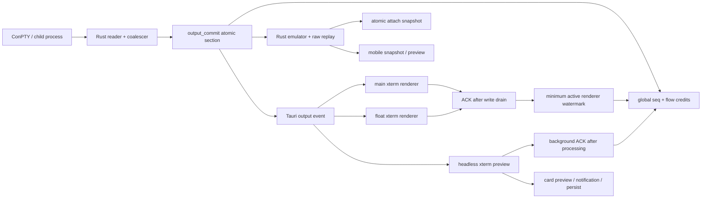

# ThreadTerm Windows 性能问题功能影响复核与优化计划

> 复核日期：2026-07-12
> 实施核对日期：2026-07-12
> 基准分支：`exp/windows-native-terminal-host` @ `6b1be21`
> 文档状态：Phase 0–2 已实施并验证；Windows 真机反馈已核对并完成低风险修正；Phase 4 修复后人工复测仍 OPEN
> 复核范围：Windows 下的内存、CPU 唤醒、输出吞吐、界面卡顿、窗口恢复，以及相关的 PTY、移动端、浮窗、Codex Chat 和 Workspace 功能契约

本文是对 Windows 性能审查结果的第二次功能影响核对。目标不是再次罗列“看起来昂贵”的代码，而是回答三个问题：

1. 这项成本是否为了某个明确功能或正确性契约而存在？
2. 如果直接删除、跳过或降低频率，会破坏什么功能？
3. 在不破坏现有行为的前提下，安全的优化边界在哪里？

本文与以下文档互补：

- `docs/project-structure-and-performance-review.md`：项目结构与通用性能审查。
- `docs/windows-lightweight-feasibility-report.md`：安装包、依赖和窗口常驻成本。
- `docs/local-and-windows-test-checklist.md`：本地与 Windows 验证流程。
- `.trellis/spec/frontend/state-management.md`：PTY 输出、快照、ACK 和持久化的权威契约。

---

## 零、2026-07-12 实施核对结果

本节是对下文每个结论和计划项的 after-state 核对。状态含义：

- **完成**：实现已存在，且有目标测试和全量门禁证据。
- **保留**：原实现承担正确性功能，本轮只优化外围成本，不删除该契约。
- **DEFER**：已完成影响分析，但缺少收益指标或存在用户体验代价，本轮不默认启用。
- **BLOCKED**：需要产品选择或当前机器缺少运行环境，不能写成通过。

### 0.1 缺陷与低风险优化逐项状态

| 编号 | 状态 | 实施结果 | 功能影响核对 |
|---|---|---|---|
| F-01 PTY state ↔ bridge 锁序 | 完成 | bridge 在 `card_mirror` 内只 clone，锁外读取 live PTY；PTY 状态修改与发布保持同一串行顺序 | 不删除状态广播，不使用 `try_lock` 丢事件；确定性 lock-scope 测试和并发发布顺序测试通过 |
| F-02 frontend PTY runtime cleanup | 完成 | remove/archive/exit/unmount/PTY replacement 统一使用 per-PTY generation lifecycle，清理 headless、buffer、ACK retry、seq、timer 和 pending output | missing-card 尾部输出仍累计 ACK；旧 callback/ACK completion 不能污染复用后的 PTY |
| F-03 Codex late listener cleanup | 完成 | async listener 晚返回时立即 unlisten，正常/失败/StrictMode cleanup 幂等 | hidden delta、completion、approval、disconnect 仍持续摄取，不按 `active` 丢协议事件 |
| F-04 float 旧销毁 timer | 完成 | Windows hide generation、visibility transition mutex、close 前仅 detach `renderer:float:*`；show 立即恢复 lease | 主窗口 consumer 保留；close 失败重显不等 5 秒 heartbeat；外部 `show_main` 路径也会发 `float-hidden` |
| F-05 Codex app-server 可见控制台 | 完成 / 待真机复测 | Windows 后台 stdio 子进程设置 `CREATE_NO_WINDOW`，保留 stdin/stdout JSON-RPC 与 kill-on-drop | 只影响 Chat 的 service-style app-server；不作用于 CLI 终端卡，不改变 ConPTY |
| F-06 main/float 共享 PTY geometry | 完成 / 待真机复测 | float show/hide 使匹配 PTY 的 WebView-local size cache 失效，活跃 surface 复用已有 fit/resize 重发一次尺寸 | 使用 `focus:false` 恢复主窗；不抢焦点、不拉底、不改变 write/ACK/snapshot/LRU |
| F-07 selector hide 漏 60s 回收 | 完成 / 待 PID 复测 | selector、显式 hide、show-main 汇入同一 low-memory + generation timer + `float-hidden` funnel | 30s hide→show→20s hide 的旧 timer 仍由 visibility epoch 拦截；只移除 float renderer scope |
| O-01 无订阅 preview snapshot | 完成 | bridge 通过 lazy closure 在确认存在 receiver 后才序列化 preview/富化广播 snapshot | Rust emulator、raw replay、seq 和新客户端 initial snapshot 仍维护 |
| O-02 2ms Condvar 轮询 | 完成 | 改为最近 renderer lease deadline，最长 1 秒 watchdog；ACK/unregister/kill 继续 notify | 保留 200/20 KiB hysteresis、最慢 renderer watermark、30 秒 TTL；TTL 边界与 lost-wake 测试通过 |
| O-03 kill 前完整 terminal snapshot | 完成 | 优先 raw bridge mirror，缺失时生成 v1 兼容 tombstone；`taskkill /T` 与 child kill 移入 blocking worker | 显式关闭仍发完整形状 `CardRemoved`；自然退出仍保留 completed/failed 卡片 |
| O-04 refresh / recovery 重复工作 | 完成 | CR/cleanup refresh 每帧合并；单 recovery generation；首次有效 geometry 只 fit/resize/scroll 一次；inactive/unmount 取消任务 | 保留 60/180/400/800ms Windows focus retry；hidden xterm 仍 write、drain 后 ACK |
| O-05 store/persist 热路径 | 完成 | output+preview 同窗口单次 Zustand 更新；相同 preview no-op；object `PersistStorage` 在 flush 时才 stringify，500ms trailing + 2s maxWait | storage key、version 18、partialize、migration、外部 JSON 与 hide/unload flush 不变 |
| C-01 atomic attach snapshot | 保留 / DEFER | 保留 `output_commit` 内 seq+raw+emulator 一致性；不做无证据的锁外序列化 | `wezterm_term::Terminal` 不可 clone；极端 Screen 深拷贝单 cell 数组约 8.64 MiB；错误拆锁会永久漏输出或重复输出 |
| C-02 headless xterm 顺序处理 | 保留 | 继续逐 chunk 按序 feed；只合并 preview/store 派生更新并跳过相同 preview | TUI、清屏、光标移动和 wrap-aware preview 不退化 |
| C-03 hidden real xterm write | 保留并优化外围 | hidden 时禁止 DOM viewport、scroll、focus、refresh 和 React indicator 副作用 | renderer 注册期间仍逐 chunk write，且只在 write drain 后 ACK |
| C-04 hidden Codex ingestion | 保留 | listener 生命周期已修复，hidden 协议摄取不变 | 全局 broker 因缺指标 DEFER，避免 approval/delta 丢失 |
| C-05 Workspace mounted editor | 安全子集完成 | 当前卡全部 editor + 其他卡仅 dirty editor 保持 mounted；key 和回调显式包含所属 `cardId`；clean 跨卡仍卸载 | 切卡不再丢 dirty draft/本地 undo-selection 类状态；删除/归档 dirty 卡的恢复 UX 仍为 BLOCKED |

### 0.2 Phase 0 门禁逐项状态

| 编号 | 状态 | 自动化证据 |
|---|---|---|
| P0-1 state / bridge 并发 | 完成 | bridge enricher 执行时 `card_mirror.try_lock()` 成功；2×1,000 次并发状态切换的最终发布值等于最终状态 |
| P0-2 main + float / 双 renderer ACK | 完成 | fast/slow renderer、超过 200 KiB、fast unregister 仍阻塞、slow unregister 后 final sentinel；float scope detach 保留 main |
| P0-3 LRU 内容恢复 | 完成 | Desktop E2E 验证隐藏期超过 200 KiB 输出、history 头尾、alternate-screen 最终帧、active buffer、cursor X6/Y9 |
| P0-4 删除/归档 lifecycle | 完成 | remove/archive/exit/unmount/restart generation、headless/buffer/map/ACK retry 清零；移动 reducer 同步清除 status/output cache |
| P0-5 Windows recovery fake timer | 完成 | `0x0 → 800x600`、geometry 一次、后续 timer 不重复 resize/scroll、inactive/unmount 取消、100 CR 每帧一次 refresh |
| P0-6 Codex 组件门禁 | 完成 | 正常/晚返回/reject cleanup、hidden approval/disconnect、两卡相同 item id、1,000 delta byte-for-byte |
| P0-7 Windows Rust test bootstrap | 完成 | fresh target `cargo test --no-run`；lib/bin test EXE 可启动；fresh 246/246；Cargo release 资源检查与 Tauri production EXE/NSIS 构建通过，无 `mt.exe` 后处理 |

诊断能力采用两层实现：Rust `cfg(test)` 计数和前端只读 lifecycle diagnostics 用于无订阅 serialization、Condvar wake、headless/buffer/ACK/map 数量；xterm write/drain/refresh/fit/resize 与 Codex listener/delta 由组件测试 spy 计数。长期运行的每 PTY attach p50/p95、producer pause、Codex React commit/heap 等生产诊断尚未实现，因此相关 Phase 3 项保持 DEFER，而不是据不完整计数宣称收益。

### 0.3 Phase 3 决策

| 实验 | 决策 | 证据与转为实验的前置 |
|---|---|---|
| P3-1 hidden renderer suspend | DEFER | main 最多 6 个 real xterm，float 最多再 1 个且已有 60 秒销毁；缺每 xterm 内存/GPU、hidden CPU、恢复 p95 和 selection/viewport 接受数据 |
| P3-2 Codex global broker | DEFER | 当前上限 18 个 listener；更可能的热点是 delta 数组/字符串复制和无界 DOM；缺真实 app-server commit、heap、long-task 数据 |
| P3-3 Workspace clean-tab LRU | 安全子集完成 / DEFER | dirty 跨卡保留已修；clean 仍按现有方式卸载。删除/归档 dirty draft 需先决定确认丢弃、自动恢复还是 tombstone UX |
| P3-4 attach 锁外序列化 | DEFER；直接拆锁 REJECT | 只允许默认 OFF 的 immutable-frame 实验；先测 attach/producer wait p50/p95/p99、吞吐和峰值内存，正确性门禁不得放宽 |

### 0.4 最终验证结果

| 验证 | 结果 |
|---|---|
| `npm run check` | 修复后通过，exit 0；lint 0 error / 27 warning、typecheck、88 files / 685 tests、mobile build、项目配置的 clippy 全部通过 |
| Desktop build | 通过，2,359 modules |
| Desktop fake-Tauri E2E | 4/4：非零退出/Restart、LRU history+cursor+TUI、scroll-up、Codex→terminal |
| Mobile Android Chromium E2E | 10/10 通过 |
| Mobile iOS WebKit E2E | BLOCKED：本机缺 `webkit-2287/Playwright.exe`，下载 10 分钟超时；10 项均未进入业务断言 |
| Windows Rust fresh debug | `cargo test --no-run` 通过；lib 246 tests；全量 246/246 通过 |
| Windows Cargo release 检查 | `cargo build --release` 与 `cargo test --release --no-run` 通过；15,321,088-byte EXE 保留 manifest/icon/version/product metadata；该 EXE 只作为 Rust/资源证据，不作为 Tauri 启动产物 |
| Windows Tauri production 构建 | 修复后独立 target 的 `npm run tauri:build:windows` 通过；EXE 16,169,984 bytes，NSIS 5,262,809 bytes；EXE SHA-256 `E4B2CD3B693490AA493A9EDE630A0A8C91D7D9825FCD5190AB911D8847D071D3` |
| Rust format / clippy | `cargo fmt --check` 通过；项目配置 `cargo clippy -- -D warnings` 通过；更严格 `--all-targets` 仍有 2 条既有 test-helper warning |
| 原生窗口启动 smoke | 通过：独立 fresh target 的 Tauri production EXE 在无 5173 listener 时打开完整 ThreadTerm 页面；可读取“新建终端 / 项目 / 终端管理器”，进程无 5173 连接 |
| macOS / Linux | 未在本机实机验证；非 Windows MSVC 代码路径保持 Tauri 默认 resource 行为 |

启动 smoke 曾暴露一项构建验收错误：直接启动普通 `cargo build --release` 的 EXE 会按开发协议读取 `build.devUrl`，在 Vite 未运行时显示 `localhost:5173` 拒绝连接。根因不是防火墙、CSP 或业务页面，而是普通 Cargo 构建没有由 Tauri CLI 注入 `tauri/custom-protocol`，也没有生成当前 `tauri-codegen-assets`。处理原则是保留 `devUrl` 供 `npm run tauri:dev` 使用，生产启动统一使用 `npm run tauri:build:windows`；构建/测试文档已增加这一门禁。

额外质量修复：当前 Rust 版本把两处既有降序 `sort_by` 提升为 clippy error；已等价改为 `sort_by_key(Reverse(...))`，paired-device 14/14 与 provider-session 8/8 通过，排序字段和降序语义不变。

### 0.5 Windows 真机反馈与修复后状态

| 项目 | 结论 |
|---|---|
| Release 冒烟 | PASS：Shell、设置、原生对话框正常；无 `0xc0000139`、黑屏或无响应 |
| 真实 ConPTY 10/100 MiB | PASS：sentinel 完整、输出后可立即输入，峰值及结束后整体约 178 MiB |
| 主窗 + float 同 PTY / 7 卡 LRU | PASS：两端持续输出、隐藏后主窗不停流、>200 KiB 与 history/cursor/TUI 恢复正常 |
| float 工作集约 240 MiB | 不能单独判为泄漏。WebView2 allocator/cache 不保证窗口销毁后立即归还 working set；必须用 float window 存在性和 renderer PID 变化验收 |
| float 60s | 找到 selector 直接 hide 漏 timer/event 的确定缺陷并已修；销毁效果仍需新 Release 的 window/renderer PID 证据 |
| OpenCode 错位 / Codex float 晃动 | 与跨 WebView stale geometry cache 高度吻合，已按不影响焦点、滚动、ACK 的方式修复；需新 Release 复测，若 Codex 仍晃动再单独分析 CSS/重绘 |
| Codex 额外控制台 / Chat 断连 | 根因明确并已修：后台 app-server 使用 Windows `CREATE_NO_WINDOW`；不隐藏或修改 CLI 终端卡 |
| 删除后 conhost | 当前旧实例下 7 个 `conhost.exe --headless` 与 7 张保留终端卡一致，不能证明 orphan；高风险 PTY teardown 保持不动，等待单卡 PID 对照 |

修复后自动化证据：定向 22 tests、全量前端 685 tests、Rust 246 tests、Desktop E2E 4/4、TypeScript、mobile build、Clippy、Rust fmt 和 diff check 全部通过。当前旧版 ThreadTerm 仍承载 7 个 PTY，单实例机制会阻止新旧 Release 并行；为避免丢失用户会话，本轮未强制关闭旧实例，因此上述 FIXED 项保留“待新 Release 人工复测”标签。

---

## 一、执行结论

### 1.1 总结

上一轮发现不能统一当作“可直接删除的性能问题”。二次核对后应分为四类：

| 分类 | 结论 | 代表项目 |
|---|---|---|
| 确认缺陷 | 不是功能所需，应在保持协议行为的前提下修复 | PTY/bridge 锁序反转、headless 生命周期清理遗漏、Codex 异步 listener 晚清理、float 旧销毁 timer |
| 低风险优化 | 功能需要保留，但当前存在可避免的计算、唤醒或重复刷新 | 无订阅 preview 序列化、2ms Condvar 轮询、重复 refresh/recovery、相同 preview 重复写 store |
| 条件性架构优化 | 可以获得更大收益，但会改变恢复延迟、selection/viewport 或持久化时效，必须先补测试并做基准 | 隐藏 xterm suspend/resume、Codex 全局事件 broker、Workspace editor LRU、attach snapshot 锁外序列化 |
| 必须保留 | 属于输出正确性、跨窗口一致性或 Windows 恢复契约，不能用“少做一点”直接优化 | 累计 ACK、最慢 renderer watermark、atomic attach snapshot、Rust emulator、headless xterm、Windows recovery 时间窗 |

核心判断是：

- **可以减少展示和派生计算，不能伪造“已消费输出”。**
- **可以降低无订阅时的工作，不能停止维护可恢复的权威终端状态。**
- **可以让隐藏 renderer 正式 detach，不能在它仍注册时跳过 write 或提前 ACK。**
- **可以合并 Windows 恢复任务，不能删除为零尺寸 WebView2 准备的恢复窗口。**
- **可以拆分热状态和持久状态，不能静默丢掉重启预览、跨 WebView 同步和未保存编辑。**

### 1.2 两项重要校正

1. **“PTY id 复用后旧 seq 会丢新输出”不成立。** 输出 seq 是进程级全局单调值，不会随 PTY id 复用而从零开始。未清理的 seq Map 仍是小型内存生命周期问题，但不是该正确性故障。
2. **Windows Git 路径失败是测试问题，不是当前产品实现错误。** `path` 是 Git 风格 `/` 相对路径，`absolute_path` 是平台文件路径。Windows 上由 `Path::join` 产生反斜杠是正确行为；把绝对路径强制替换为 `/` 可能破坏 UNC、extended path、文件打开和 tab identity。

---

## 二、Windows 实测上下文

本轮判断使用了优化前采集的真实 Windows 运行数据；这些性能数字只作为当前机器的 baseline，不应外推为所有设备的承诺。优化后的自动化结果已更新，并补做了 Tauri production 原生窗口启动 smoke；完整的优化后冷/暖启动、内存和长时间压力对比仍未重测，因此不把基础启动通过写成性能收益。

| 项目 | 当前结果 |
|---|---|
| 系统 | Windows 10 19045 |
| CPU / 内存 / GPU | Ryzen 7 5800 / 31.9 GiB / Radeon RX 6800 XT |
| 首个冷窗口 | 原生窗口约 528 ms；内容可见约 3.06 s |
| 暖窗口 | 约 167–185 ms |
| 应用稳定内存 | 约 452–522 MiB working set；374–422 MiB private bytes |
| 空闲 CPU / GPU / 网络 | CPU 通常约 0.04–1.6% 单核；GPU 小于 0.01%；未观察到网络活动 |
| 进程退出 | 主进程退出后 WebView2 子进程均能清理 |
| 7 卡 LRU 压力 | 256 KiB fake-Tauri 输出场景 5/5 通过，每轮约 28.6–29.5 s（包含搭建和导航） |
| 优化后前端门禁 | 88 files / 685 tests；Desktop E2E 4/4；Android mobile E2E 10/10 |
| 优化后 Rust / 生产构建门禁 | fresh target 246/246；debug/release test EXE 均可直接启动；Tauri production EXE/NSIS 构建及无 localhost 启动 smoke 通过，无手工 manifest 后处理 |
| 原 Rust/Git 阻断 | 已修复：Git relative/absolute path 分开做平台感知断言，运行时路径逻辑未改 |

仍未闭环的实测项：

- 新 Release 下验证 Codex Chat 不再创建可见控制台，并复测断连后的滚动场景。
- 新 Release 下复测 OpenCode 主/浮窗切换、Codex float 晃动和自动 geometry 恢复。
- 通过窗口对象及 WebView2 renderer PID 验证 float 连续隐藏 60 秒后的销毁；不能只看工作集。
- Windows 多屏、125% / 150% / 200% DPI、快速 hide/show 下的逐档恢复记录。
- 单张新 Shell 卡记录 shell + headless conhost PID，删除后等待并核对两者是否退出。

---

## 三、必须保持的跨层契约

PTY 输出不是一条“读取后直接显示”的简单链路。一个 chunk 同时影响后端恢复状态、主/浮窗显示、卡片预览、通知、移动端和流控。



以下不变量必须在任何优化中保持：

1. `seq`、emulator 状态、raw replay 和 flow credit 在同一个 `output_commit` 屏障内提交。
2. renderer ACK 只能在对应 xterm `write` callback drain 后推进。
3. 存在多个 renderer 时，以最慢 renderer 的累计 watermark 结算；最快者不能替最慢者确认。
4. attach snapshot 必须与其 `seq` 对应；前端先应用 snapshot，再处理更大的 live seq。
5. background ACK 只能代表 headless/store 路径确实处理了输出；缺失 card 是规范允许的快速 ACK 例外。
6. 无 renderer/background consumer 时，达到高水位后暂停是有意行为，等待未来 atomic attach 追平。
7. hidden/LRU renderer 若不再消费，必须先 unregister；不能保持注册同时跳过输出。

这些契约主要由 `881b55f`（累计 ACK 重构）、`10d2d01`（多终端 PTY 切换）、`.trellis/spec/frontend/state-management.md:97-248` 和 `.trellis/spec/frontend/component-guidelines.md:150-176` 固化。

---

## 四、逐项功能影响复核

### 4.1 确认缺陷：应修复，但不能删除其承载的功能

#### F-01：PTY state 与 bridge `card_mirror` 锁序反转

**结论：确认的高风险并发缺陷，不是功能性成本。**

当前存在相反的加锁方向：

```text
线程 A：session.state -> bridge.card_mirror
线程 B：bridge.card_mirror -> session.state
```

证据路径：

- `src-tauri/src/pty/session.rs:208`：持有 `session.state.write()` 时 emit 并调用 bridge。
- `src-tauri/src/bridge/mod.rs:109`：持有 `card_mirror` 时 enrich live PTY state。
- `src-tauri/src/bridge/mod.rs:195`：按 PTY 查 mirrored card 时也存在相同方向。
- `src-tauri/src/bridge/mod.rs:622`：状态广播需要 PTY 到 Card 的映射。

不能采用的修法：

- 删除状态广播：移动端不再实时看到 Running/Waiting/Idle。
- 改用 `try_lock`：死锁变成随机丢状态或不完整 snapshot。
- 只把 RwLock 换成 Mutex：锁序环仍然存在。

安全方向：

1. `set_session_state` 只在锁内比较和写入，克隆 changed state 后释放锁。
2. 释放锁后再执行 Tauri emit 和 bridge broadcast。
3. bridge snapshot 和 mirrored-card lookup 在锁内只 clone，释放 `card_mirror` 后再 enrich。
4. 增加规则：持有 PTY/bridge 内部锁时不得调用另一个子系统或 Tauri emit。

#### F-02：删除/归档后 headless 与运行时 Map 清理不完整

**结论：确认的生命周期缺陷；应清理实例，不能删除 headless 表示层。**

`TerminalEventBridge` 的 exit 路径先查 card；card 已由 remove/archive 同步移除时会提前返回，后面的 `disposeHeadless` 无法执行。相关 seq/ACK/retry/output-buffer Map 也需要统一生命周期清理。

安全方向：

- 在 card remove、archive、exit 和 bridge unmount 建立幂等的 `disposePtyRuntime(id)`。
- 清理 headless、output buffer、ACK retry、seq/watermark 和 timer。
- 缺失 card 的尾部输出仍需快速 ACK，避免不存在的 UI 卡住 PTY。
- 清理与新的 attach/restart 之间需要 generation，避免旧 cleanup 删除新实例。

直接删掉 headless 会破坏：TUI wrap-aware preview、通知摘要、selector/mobile preview 和后台 ACK 语义。

#### F-03：Codex 异步 listener cleanup 竞态

**结论：确认的 listener 生命周期缺陷；后台事件摄取本身仍需保留。**

当组件 cleanup 先发生、异步 `listen()` Promise 后返回时，返回的 unlisten 可能永远没人调用。StrictMode、快速切卡和 LRU 卸载会放大该问题。

安全方向：

- listener Promise resolve 时检查 cancelled；已取消则立即调用刚返回的 unlisten。
- cleanup 必须幂等，且每个 listener 恰好注销一次。
- 中期改为全局 Codex event broker，避免每个隐藏 view 都注册三套全局 listener。

不能用 `active` 阻断协议事件：隐藏期间的 delta、turn completion、approval/request 仍是一次性事件，错过后不一定能从 thread snapshot 恢复。

#### F-04：Windows float 60 秒销毁 timer 没有代际

**结论：确认的窗口生命周期缺陷。**

当前每次 hide 都创建独立 timer：

```text
t=0 hide -> 旧 timer 计划 t=60 检查
t=30 show
t=40 再 hide -> 新 timer 计划 t=100 检查
t=60 旧 timer 看到当前仍 hidden，于是提前关闭
```

第二次只连续隐藏了 20 秒，却被第一次 timer 关闭。

安全方向：

- 记录 `hide_generation` 或 `hidden_since`，show 时使旧 timer 失效。
- 只有自最后一次 hide 连续 60 秒才允许 close。
- close 前显式 detach/unregister renderer，不能把正常清理依赖于 30 秒 lease TTL。
- show 前恢复 WebView2 Normal memory target。

### 4.2 功能必须保留，但当前成本可降低

#### O-01：无 bridge 订阅者时仍生成完整 preview snapshot

**设计目的：** preview 必须来自当前终端屏幕，而不是最后一个 raw chunk，才能正确处理 `\r`、清屏、光标移动和 alternate-screen TUI。

**问题：** `flush_preview` 先序列化最多 3,000 行 emulator 状态，随后 `broadcast_preview` 才检查订阅者。无移动端连接时，广播为零成本，但序列化已经发生。

**安全优化：**

- 在 snapshot 序列化之前判断 subscriber。
- 更稳妥地提供 lazy API：bridge 只有确认存在 receiver 时才执行 snapshot closure。
- 只跳过周期性 preview 派生；emulator `apply_output`、raw replay 和 seq 必须继续维护。
- Waiting、EOF、attention 时有订阅者仍要强制 flush。

#### O-02：背压状态下 2ms Condvar 周期唤醒

**设计目的：** 轮询主要用于 renderer 崩溃后等待 30 秒 lease 过期；ACK、unregister 和 kill 都会 notify。

**问题：** 每个受背压 PTY 每秒最多产生约 500 次唤醒；多个阻塞会话会形成无意义 CPU wakeup。

**安全优化：**

- 按最近 renderer lease 到期时间计算 Condvar deadline。
- ACK、unregister、kill 继续 notify，并在每次唤醒后重新计算。
- 保留低频 watchdog 或建立 killed 与 flow mutex 的同步，避免 lost wake。
- 保持 200 KiB 高水位、20 KiB 低水位和 hysteresis。

不能删除或改写的部分：

- background ACK 不能在存在 renderer 时释放 renderer credit。
- 不能从最小 renderer ACK 改成最大 ACK。
- 不能删除 TTL，否则崩溃 WebView 会永久停流。
- 不能把 TTL 大幅缩短，否则大 snapshot 写入期间可能误逐出健康 renderer。

#### O-03：`pty_kill` 前生成完整 live terminal snapshot

**设计目的：** 显式关闭必须发送 `CardRemoved { card: CardMeta }`，让移动端无需重连就删除卡片。自然 exit 仍应保留 completed/failed 卡片。

**问题：** 当前为了构造 CardMeta，会在 Windows `taskkill /T` 前序列化完整终端；移动端 reducer 实际只依赖 `card.id`，且常见情况下 bridge mirror 已有 CardMeta。

**安全优化：**

1. 保持现有 wire schema 和显式关闭/自然退出语义。
2. 优先 clone bridge mirror 中已有的 CardMeta，不做 live terminal enrich。
3. mirror 缺失时构造轻量 tombstone，至少保持 id、project/cwd 和状态字段。
4. 无订阅者时跳过 CardRemoved 的重型数据准备。
5. 把 Windows `taskkill` 和其他同步 child wait 放入 blocking worker。

若未来把协议改为仅 `card_id`，必须升级或兼容协议版本，不能静默改变 v1 payload。

#### O-04：`scrollToBottom`、full refresh 和 Windows surface recovery 重复执行

**设计目的：**

- 只有用户原本在底部或处于 alternate screen 时才跟随输出。
- 用户阅读历史或存在 selection 时不能被拉回底部。
- activation 时同步 xterm 与 React 的 `scrolledUp`/新行提示状态。
- Windows WebView2 show 后前几帧可能仍是 0x0，60/180/400/800ms recovery 防止默认尺寸、黑屏、未铺满和首次焦点失败。

这部分由 `f00264f3`、`85ad03c`、`825cf42` 和 `.trellis/spec/frontend/quality-guidelines.md:803-815` 固化。

**安全优化：**

- 稳态输出与 activation recovery 拆成两个 helper。
- `\r`/cleanup sequence 的 refresh 使用单一 RAF scheduler，每帧最多一次。
- 每个 Shell 只保留一个 recovery generation，重复事件合并 flags。
- 首次获得有效尺寸并成功 fit 后，取消剩余 geometry timer。
- geometry、refresh、focus、scroll 分别结算；scroll 只在首次成功时执行。
- hide/inactive/unmount 后取消当前 generation。
- 后续 timer 不得再次把已经手动上滑的用户拉到底部。

不能整体删除 800ms 恢复窗口，也不能依赖 ResizeObserver 完全替代 native hide/show 恢复。

#### O-05：Zustand persist 热路径序列化与跨窗口时效

**设计目的：** persist 不只保存输出，还保存 cards、archives、provider binding、自动重启历史、pinned/recent/project/worktree、通知、设置和重启前 preview；selector/float 通过 storage event 与 rehydrate 获取跨 WebView 状态。

**安全优化：**

- 把高频 runtime output 与 durable card metadata 拆成不同更新路径。
- 外部持久化 shape 保持兼容，只改变 checkpoint 时机。
- output 与 preview 合并为一次 card update；preview 相同则 no-op。
- 使用带 `maxWait` 的 throttle，持续输出期间也按上限周期落盘，hide/unload 强制 flush。
- 确保 stringify 位于真正的节流边界内，而不是先 stringify 再延迟 setItem。
- broad `cards` consumer 改为稳定的 metadata projection。

直接移除 `lastOutput`/`lastReplyPreview` 会让重启后的卡片、selector 和 mobile meta 为空，属于用户可见行为变化，必须有迁移和产品决策。

### 4.3 明确的功能性成本：不能直接“修掉”

#### C-01：Atomic attach snapshot 持有 `output_commit`

这是输出一致性屏障，不是普通锁竞争：

```text
commit: seq -> emulator -> raw replay -> credit
attach: 在同一把锁下读取与 seq 对应的 snapshot/raw
```

直接把 snapshot 序列化移到锁外可能产生“新 seq + 旧屏幕”，前端会把中间输出当作已被 snapshot 覆盖而永久跳过。

只有以下方案可以进入实验：

- 锁内取得与 seq 对应的不可变 emulator/raw 副本，锁外序列化。
- versioned optimistic snapshot：序列化后检查 generation，变化则重试。
- 把阻塞 RPC 放入 blocking worker只能保护 async executor，不能自动缩短 producer pause。

若 emulator 不能安全 clone，应保留现有实现，先测量 attach p50/p95 和 producer pause，再决定是否值得重构。

#### C-02：Headless xterm 每个 chunk 按序处理

Headless xterm 是五种输出表示之一，负责把 ANSI/TUI 状态转换成 wrap-aware 卡片预览。简单 strip ANSI 无法正确处理光标移动、清屏、局部重绘和 composer 区域。

可以优化：

- 每个 chunk 继续按序 write，但最后 32 行 preview extraction 最多每 50–100ms 一次。
- status/exit/attention 前 flush pending preview。
- 相同 preview 不写 store。
- 若要合并多个 chunk 为一次 `term.write`，先证明分裂 ANSI sequence、CJK 和 alternate screen 等价。

不能按 `active`、pinned 或可见性直接停止 headless feed。

#### C-03：隐藏 real xterm 继续 `term.write`

当前最多保留 6 个 TerminalView 的 LRU，目的是切卡时保留 parser、alternate buffer、cursor、scrollback、selection 和即时恢复。

只要 renderer 仍注册，隐藏时就必须继续：

```text
receive output -> xterm.write -> drain callback -> cumulative ACK
```

两种粗暴优化都会出错：

- 跳过 write 且不 ACK：隐藏 renderer 成为最慢 watermark，超过 200 KiB 后整个 PTY 停流。
- 跳过 write 但直接 ACK：后端认为已经消费，隐藏 xterm 永久缺输出，ANSI/TUI parser 状态损坏。

低风险优化只能门控展示副作用：不查 DOM viewport、不 focus/scroll、不更新隐藏 React 指示器、合并 refresh。

真正停止隐藏写入必须采用完整 suspend/resume 协议：

1. hide 时先 unregister consumer 并解绑 listener。
2. 再 dispose/suspend xterm。
3. show 时先注册 listener/consumer。
4. 获取 atomic attach snapshot。
5. snapshot 全部分片 drain 后 ACK barrier。
6. 再处理更高 seq 的 live output。

这种方案会增加恢复延迟，并丢失 selection、精确 viewport 等 xterm-only 状态，不能作为无行为变化优化。

#### C-04：隐藏 Codex Chat 继续摄取事件

隐藏期间仍需接收 token delta、turn completion、approval/request 和 disconnect。审批请求是一次性 emit，重新加载 thread 不保证恢复；直接按 `active` 门控会丢回复尾部或让 app-server 永久等待审批。

可优化的是 UI 成本，而不是协议摄取：

- 全局只注册一组 Codex listeners。
- 按 card/thread 维护规范化模型和 pending request。
- hidden card 更新轻量模型，不提交隐藏 DOM。
- active view 只订阅当前 card；delta 每帧或几十毫秒合批。
- rows memo/virtualization，并为 preview 设置有界长度。

#### C-05：Workspace tab 保持 mounted

隐藏 editor 保留未保存 draft、undo、selection、scroll 和 CodeMirror 状态；workspace view 后面的 terminal 也需继续存活，避免 CLI 重启并保持输出 ACK。

不能直接 unmount 所有隐藏 tab。可行方向是：

- 先隔离 store 订阅和昂贵派生计算。
- 只对 clean editor 做 LRU；dirty editor 必须保留或要求用户确认。
- tab identity 必须包含 project/worktree/card 作用域，不能只按 path 全局复用。
- 删除/归档卡片时要定义 dirty workspace 的明确处置，不能静默清空 Map。

---

## 五、测试与基础设施结论

### 5.1 Windows Rust test manifest

当前 release 已包含 Common Controls v6 manifest，但 Cargo 生成的 Rust libtest EXE 没有继承 Tauri bin resource，导入 `TaskDialogIndirect` 时会以 `0xc0000139` 退出。手工嵌入同一 manifest 后，测试可正常运行。

安全修复边界：

- 只在 `CARGO_CFG_TARGET_OS=windows && CARGO_CFG_TARGET_ENV=msvc` 下使用 Cargo 的 test-only linker 参数。
- 首选复用 Tauri 生成的 resource，或单独生成 manifest-only resource。
- 不得用全局 linker arg、覆盖 release RT_MANIFEST，或把 `mt.exe` 后处理当成正式构建流程。
- macOS/Linux 和 Windows GNU target 不应收到 MSVC 参数。

### 5.2 Git status 路径测试

立即修复应修改测试断言：

- 用 `Path::new("/repo/app").join("docs/new file.md")` 构造 expected absolute path。
- 单独断言 repo-relative `path == "docs/new file.md"`。
- 不要在实现中把 `absolute_path` 强制 replace 成 `/`。

若未来要把 Windows 路径统一成原生格式，应同时规范化 `repository_root` 与 `absolute_path`，并回归 Changes/Explorer 打开同一文件时的 tab 去重、diff、save、drive、UNC、空格和 Unicode。

### 5.3 现有回归保护强度

| 区域 | 保护强度 | 已有保护 | 主要盲区 |
|---|---|---|---|
| Background ACK | 强 | cumulative ACK、失败重试、missing-card ACK、snapshot 重建、slowest renderer、TTL、高/低水位、LRU 后超过 200 KiB | 真实 Tauri 多窗口、系统挂起、慢 callback |
| LRU + snapshot | 中强 | cap=6、当前卡保护、驱逐顺序、重新 attach、raw fallback | 驱逐后完整 history/cursor/ANSI 内容、WebGL 释放、main+float |
| Scroll-up | 强 | 真实 Chromium 上滑后继续输出不拉底、按钮回底、activation 恢复 | selection、PageUp、float、snapshot 后 viewport、新行准确计数 |
| Float / selector | 弱 | reducer、偏好同步、xterm registry 纯测试 | 真实 hotkey/show/hide/focus/storage/PTY attach/双 ACK |
| 删除 / 归档 | 中 | store 数据和通知/pinned 清理、移动端语义 | `pty.kill`、CardRemoved、headless/output buffer、dirty workspace |
| Persist | 中 | version 18、key shape、migration、debounced storage、hide flush | 当前版本完整 round-trip、quota、大数据、多 WebView 时效 |
| Codex streaming | 极弱 | 少量 normalize 纯函数测试 | listener、delta 顺序/合批、审批、换卡、断线、隐藏恢复 |
| Workspace tab | 中 | 文件/diff 打开、每卡隔离、close actions | dirty draft/undo/selection、内存上限、删除归档、真实后台 ACK |

---

## 六、优化实施计划

实施顺序必须遵循“先锁定行为，再改热路径，最后做有用户体验权衡的架构实验”。每个阶段应独立提交、独立测量，避免性能变化和协议变化混在同一提交中。

### Phase 0：补齐门禁与可观测性

目标：在修改前把最容易被性能优化破坏的行为变成可自动验证的契约。

| 编号 | 任务 | 验收条件 |
|---|---|---|
| P0-1 | PTY state 与 bridge snapshot 并发测试 | Running/Waiting/Idle 高频切换、snapshot、card add/remove 并发，在超时内完成且状态映射正确 |
| P0-2 | main + float 双 renderer ACK 集成测试 | 一个快、一个慢；快者不能释放慢者 credit；unregister 后立即恢复；超过 200 KiB 后仍得到 final sentinel |
| P0-3 | LRU 内容恢复 E2E | 被驱逐卡隐藏期输出、历史文本、cursor/TUI 最终状态在重新激活后存在，不只断言 attach 次数 |
| P0-4 | 删除/归档生命周期测试 | `pty.kill`、CardRemoved、headless/output-buffer/Map 清理、float 正显示该卡时的行为均明确 |
| P0-5 | Windows recovery fake-timer 测试 | `0x0 -> 有效尺寸` 最终恢复；成功后 timer 取消；hide/unmount 后不再 fit/focus/scroll |
| P0-6 | Codex fake app-server 组件测试 | 两卡相同 item id、1,000 delta、completion/unmount/换卡 flush、late listener cleanup、隐藏审批均正确 |
| P0-7 | Windows Rust test bootstrap | fresh target 下 `cargo test --no-run` 生成的 test EXE 能列出并运行测试；release manifest 不变 |

同时增加只在测试/诊断构建启用的计数器：

- preview snapshot serialization 次数。
- 每 PTY Condvar wakeup 次数和背压持续时间。
- xterm `write`、drain ACK、refresh、fit、resize 次数。
- 活跃 headless 数量、output lifecycle Map 大小。
- Codex listener 数量、delta 输入数和 React commit 数。

### Phase 1：功能等价的确定性修复

这些项目的目标是修复缺陷或删除无订阅成本，不应改变用户行为。

1. 修复 PTY state ↔ bridge card mirror 锁序反转。
2. 建立统一、幂等、有 generation 的 PTY 前端 runtime cleanup。
3. 修复 Codex late listener cleanup。
4. 给 float 60 秒销毁增加 generation，并在 close 前显式 unregister。
5. 为无订阅 preview 增加 lazy snapshot gate。
6. Windows MSVC test target 注入 Common Controls v6 manifest。
7. 将 Git status 绝对路径测试改为平台感知断言。

Phase 1 退出条件：

- 所有 Phase 0 门禁通过。
- 无订阅 10/100 MiB 压力下 preview serialization 计数为零，之后连接移动端仍能得到完整 initial snapshot。
- delete/archive/restart 后 headless 和 lifecycle Map 回到预期数量。
- Windows 全量 Rust 测试无需手工处理即可运行。

### Phase 2：低风险热路径优化

1. Condvar 改为 deadline-based wait，保留 ACK/TTL/hysteresis 和低频安全 watchdog。
2. `\r`/cleanup refresh 合并为每帧最多一次。
3. surface recovery 改为单 generation，首次 geometry 成功后取消剩余 geometry retry。
4. preview 相同则不写 store；output + preview 尽可能合并为一次 card 更新。
5. persist 增加 `maxWait`，确保持续输出时也有有界跨窗口/落盘时效。
6. `pty_kill` 优先使用 mirrored CardMeta，避免完整 terminal serialization；保持协议兼容。
7. hidden real xterm 只关闭 paint/focus/scroll/React 指示器等展示副作用，仍按序 write + drain ACK。

Phase 2 退出条件：

- ACK seq 与最终 xterm/headless 内容逐字节一致，无缺口、重复或乱序。
- main+float、LRU、HMR、attach 失败、renderer crash 和 kill 等路径均能解除背压。
- 100 个 `\r` chunk 每帧最多一次手工 refresh。
- Windows recovery 在首次成功后不再重复 resize/scroll，用户上滑不被后续 timer 拉回。
- 相同 preview 不触发 store/persist；持续输出仍在规定 `maxWait` 内同步 selector/float。

### Phase 3：有体验权衡的架构实验

Phase 3 默认不直接落地，必须用 Phase 0/2 的指标证明成本值得承担，并以 feature flag 或可回退实现验证。

#### P3-1：隐藏 renderer adaptive suspend

- 先保留 2–5 秒 warm xterm。
- 长时间隐藏或高输出时 unregister + dispose renderer。
- 恢复时通过 atomic snapshot 重建。
- 单独记录 selection/viewport 丢失和恢复 p95，决定是否接受。

#### P3-2：Codex 全局事件 broker

- 全应用只有一组 notification/request/disconnected listeners。
- 按 card/thread 维护协议模型和 pending requests。
- hidden card 不更新 DOM，active view 按帧/时间片合批。
- 1,000 delta 后正文必须 byte-for-byte 一致，listener 数量不随卡数增长。

#### P3-3：Workspace clean-tab LRU

- 仅允许驱逐 clean editor。
- dirty editor 保留或先确认。
- 重建后验证内容、selection/scroll 的产品接受度。
- card 删除/归档的 dirty draft 处置必须显式设计。

#### P3-4：Attach snapshot 锁时长实验

- 先测高吞吐期间 attach p50/p95 和 producer pause。
- 只有 emulator 可取得一致的不可变副本时，才尝试锁外序列化。
- 或使用带 generation 校验的 optimistic snapshot；失败必须重试。
- snapshot/live/ACK 数据完整性门禁不允许放宽。

### Phase 4：完整 Windows 验收

使用同一台机器、同一构建配置和同一工作负载做修改前后对比：

1. 冷启动窗口、内容可见、首次可交互时间。
2. 暖开 main/float/selector 时间。
3. 空闲 10 分钟的 working set、private bytes、CPU wakeup、GPU。
4. 单卡 10 MiB / 100 MiB 输出的吞吐、UI 输入延迟、最终 sentinel。
5. 7 卡 LRU、多卡并行输出、主窗 + float 同 PTY。
6. 隐藏 60 秒、快速 hide/show、WebView crash/reopen。
7. TUI alternate screen、`\r` spinner、clear/cursor/CJK/emoji/ANSI 分裂序列。
8. 用户上滑、selection、回底、新行提示。
9. 移动端 initial snapshot、preview、CardRemoved 和自然 exit。
10. Codex hidden stream、approval、disconnect、切卡和重新激活。
11. Workspace dirty draft、undo、selection、diff/save 和多 worktree tab identity。

性能接受标准使用相对基线而不是绝对承诺：

- 正确性测试必须 100% 通过，任何输出缺口、重复、状态错配或 orphan process 都阻断合入。
- 低风险优化不得让冷/暖启动或空闲内存出现超过测量噪声的稳定回退。
- 只有同时满足“指标改善、功能门禁通过、可回退”时，Phase 3 实验才可转为默认行为。

---

## 七、明确禁止的优化方式

以下做法即使能降低局部 CPU/内存，也不应进入实现：

1. renderer 仍注册时按 hidden/active 跳过 `term.write`。
2. 在 xterm/headless write drain 前推进 ACK。
3. 用最大 renderer ACK 替代最小 watermark。
4. 删除 renderer TTL，或把 TTL 缩短到可能覆盖大 snapshot 写入时间。
5. 分开读取 snapshot 与 seq，或在 snapshot 完成前直接写 live output。
6. 用 256 KiB raw tail 完全替代 Rust emulator 和 3,000 行状态。
7. 用最后一个 raw chunk/ANSI strip 完全替代 headless TUI preview。
8. 整体删除 Windows 60/180/400/800ms recovery。
9. 为省内存直接 unmount dirty Workspace editor。
10. 按 active 停止 Codex 协议事件和 approval request 摄取。
11. 删除 `CardRemoved` 或静默改变 mobile v1 wire schema。
12. 把 Windows `absolute_path` 强制转换为 `/`。
13. 用全局 linker arg 或后处理覆盖 release manifest 来修 Rust test EXE。

---

## 八、推荐提交顺序

为降低回归定位成本，建议保持以下提交边界：

1. `test:` 新增并发、双 ACK、recovery、Codex 和 lifecycle 门禁。
2. `fix:` PTY/bridge 锁序。
3. `fix:` headless/runtime cleanup 与 Codex late unlisten。
4. `fix:` float destroy generation 和 explicit unregister。
5. `build(test):` Windows libtest manifest 与跨平台 Git path 断言。
6. `perf:` no-subscriber lazy preview。
7. `perf:` deadline Condvar。
8. `perf:` refresh/recovery scheduler。
9. `perf:` store/persist no-op、合批和 maxWait。
10. `perf:` lightweight CardRemoved metadata。
11. `experiment:` hidden renderer、Codex broker、Workspace LRU 或 snapshot clone；每项独立 feature flag 和独立基准。

每个提交在合入前都应运行 `gitnexus_detect_changes`（工具可用时）、目标单测、全量检查和对应 Windows 真机用例。任何跨层协议改动必须同时审查 Rust、Tauri payload、主窗口、float/selector 和 mobile consumer。

---

## 九、最终判断

Windows 性能优化的正确方向不是删除终端状态层或减少 ACK，而是：

- 删除无订阅、无变化、重复恢复和重复展示造成的工作；
- 缩短跨子系统锁范围，明确 renderer 生命周期；
- 将协议摄取与 UI 渲染分离；
- 对真正隐藏且长期不用的 renderer 使用正式 detach/snapshot 恢复，而不是伪装成已消费；
- 用真实 Windows 多窗口和大输出基准决定是否接受 selection、viewport 和恢复延迟上的权衡。

优先级最高的不是激进改架构，而是先修锁序和生命周期缺陷、补齐 float/Codex/Windows recovery 的测试盲区，然后再优化已被指标证明的热路径。
